# AWS Elastic Kubernetes Service Lab

## Overview

Fabrikam Medical Conferences (FabMedical) provides conference website services tailored to the medical community. They are refactoring their application code, based on node.js, so that is can run as a Docker application, and want to implement a POC that will help them get familiar with the development process, lifecycle of deployment, and critical aspects of the hosting environment.  They will be deploying their applications to AWS Elastic Kubernetes Service (EKS) and want to learn how to deploy microservices and scale them on demand.

In this hands-on lab, you will assist with completing this POC with a subset of the application code base.  You will create a build agent based on Linux, and an EKS cluster for running deployed applications.  You will be helping them to complete the Docker setup for their application, test locally, push to an image repository, deploy to the cluster, and test load-balancing at scale.

## Exercise 1: Check your setup

Before you follow these instructions for the lab, you should have performed the setup steps at the workshop content repository here:

[AWS EKS Lab Setup](../../Lab_Setup/AWS_EKS_Lab_Setup/Lab_Setup_For_AWS_EKS.md)

Each lab has individual setup steps for the environment. In task 6, you connect to the build agent. Follow those instructions again at this time to open a command shell connected to that build agent and proceed to Exercise 2.

## Exercise 2: Create and run a Docker application

**Duration**: 40 minutes

In this exercise, you will take the starter files and run the node.js application as a Docker application.  You will create a Dockerfile, build Docker images, and run containers to execute the application.

**NOTE: Complete these tasks from the WSL window with the build agent session.**

### Task 1: Test the application

The purpose of this task is to make sure you can run the application successfully before applying changes to run it as a Docker application.

1. From the WSL window, navigate to the `content-api` directory and run `npm install`.

    ```bash
    cd content-api
    npm install
    ```

2. Start the API as a background process.

    ```bash
    nodejs ./server.js &
    ```

    

3. Press `ENTER` again to get to a command prompt for the next step.
4. Test the API using `curl`.  You will request the speakers content, and this will return a JSON result.

    ```bash
    curl http://localhost:3001/speakers
    ```

5. Navigate to the web application directory, run `npm install`, and then run the application as a background process as well.  Ignore any warnings you see in the output; this will not affect running the application.

    ```bash
    cd ..
    cd content-web
    npm install
    nodejs ./server.js &
    ```

    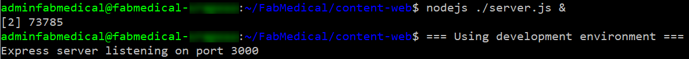

6. Press `ENTER` again to get a command prompt for the next step.
7. Test the web application using `curl`.  You will see HTML output returned, without errors.

    ```bash
    curl http://localhost:3000
    ```

8. Leave the application running for the next task.
9. If you received a JSON response to the `/speakers` content request and an HTML response from the web application, your environment is working as expected.

### Task 2: Enable browsing to the web application

In this task, you will open a port range on the agent VM's security group so that you can browse to the application for testing.

1. From the AWS console, navigate to the EC2 Dashboard, then select **Security Groups**.
2. Select the **fabmedical-build-agent** group.

    

3. Click the **Inbound** tab in the bottom pane, then click **Edit**.

    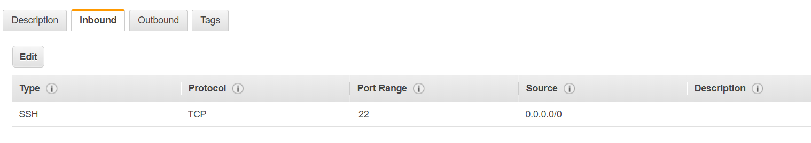

4. Click **Add Rule** then enter the following details for the new rule.  Then click **Save**.

    a. Choose **Custom TCP Rule**.

    b. Enter 3000-3010 as the port range.

    c. Choose **Anywhere** as the source.

    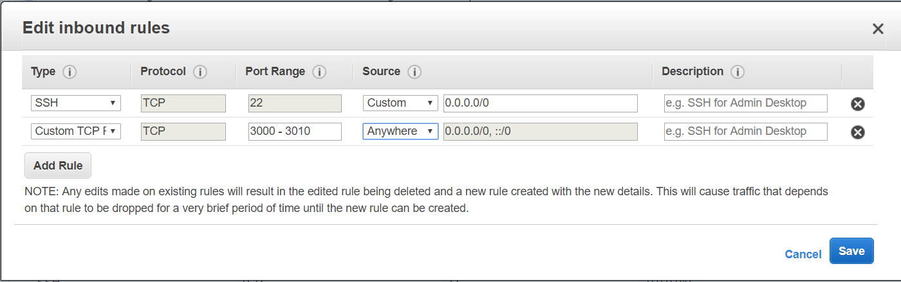

5. Return to the EC2 instance list and take note of the build-agent's IP once more.

    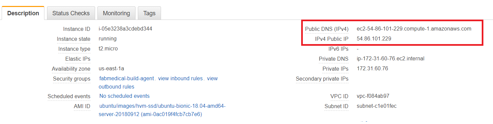

6. Test the web application from a browser.  Navigate to the web application using your build agent IP address at port 3000.

    ```text
    http://[BUILDAGENTIP]:3000
    EXAMPLE: http://13.68.113.176:3000
    ```

7. Select the **Speakers** and **Sessions** links in the header.  You will see the pages display the HTML version of the JSON content you curled previously.
8. Once you have verified the application is accessible through a browser, go to your WSL window and stop the running node processes.

    ```bash
    killall nodejs
    ```

### Task 3: Create a Dockerfile

In this task, you will create a new `Dockerfile` that will be used to run the API application as a containerized application.

**NOTE: You will be working in a Linux VM without friendly editor tools.  You must follow the steps very carefully to work with Vim for a few editing exercises if you are not already familiar with Vim.**

1. From WSL, navigate to the `content-api` folder.  List the files in the folder with this command.  The output should look like the screenshot below.

    ```bash
    cd ..
    cd content-api
    ll
    ```

    

2. Create a new file named `Dockerfile` and note the caseing in the name.  Use the following `vim` command to create a new file.  The WSL window should look as shown in the following screenshot.

    ```bash
    vi Dockerfile
    ```

    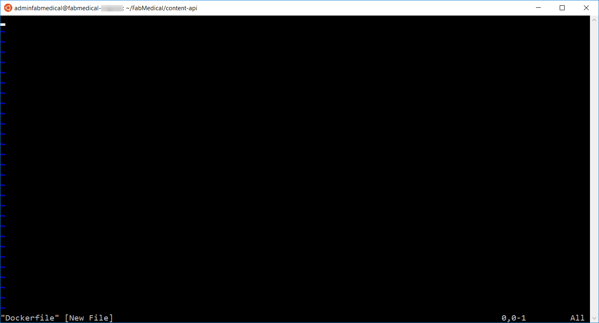

3. Select `i` on your keyboard.  You'll see the bottom of the window showing `INSERT` mode.

    

4. Type the following into the file.  These statements produce a `Dockerfile` that describes the following:

    - The base stage includes environment setup which we expect to change very rarely, if at all.

      - Creates a new Docker image from the base image node:alpine. This base image has node.js on it and is optimized fro small size.

      - Add `curl` to the base image to support Docker health checks.

      - Creates a directory on the image where the application files can be copied.

      - Exposes application port 3001 to the container environment so that the application can be reached at port 3001.

    - The build stage contains all the tools and intermediate files needed to create the application.

      - Creates a new Docker image from node:argon.

      - Creates a directory on the image where the application files can be copied.

      - Copies package.json to the working directory.

      - Runs npm install to initialize the node application environment.

      - Copies the source files for the application over to the image.

    - The final stage combines the base image with the build output from the build stage.

      - Sets the working directory to the application file location.

      - Copies the app files from the build stage.

      - Indicates the command to start the node application when the container is run.

    >**NOTE: Type the following into the editor, as you may have errors with copying and pasting.**

    ```Dockerfile
    FROM node:alpine AS base
    RUN apk -U add curl
    WORKDIR /usr/src/app
    EXPOSE 3001

    FROM node:argon AS build
    WORKDIR /usr/src/app

    # Install app dependencies
    COPY package.json /usr/src/app/
    RUN npm install

    # Bundle app source
    COPY . /usr/src/app

    FROM base AS final
    WORKDIR /usr/src/app
    COPY --from=build /usr/src/app .
    CMD [ "npm", "start" ]
    ```

5. When you are finished typing, hit the `ESC` key and type `:wp` and hit the `ENTER` key to save the changes and close the file.

    ```bash
    <ESC>
    :wq
    <ENTER>
    ```

6. List the contents of the folder again to verify the new `Dockerfile` has been created.

    ```bash
    ll
    ```

    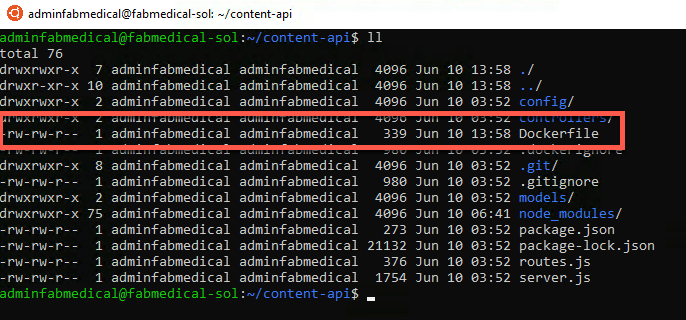

7. Verify the file contents to ensure it was saved as expected.  Type the following command to see the output of the `Dockerfile` in the command window.

    ```bash
    cat Dockerfile
    ```

### Task 4: Create Docker images

In this task, you will create Docker images for the application - one for the API application and another for the web application.  Each image will be created via Docker commands that rely on a `Dockerfile`.

1. From WSL, type the following command to view any Docker images on the VM.  The list will be empty.

    ```bash
    docker images
    ```

2. From the `content-api` folder containing the API application files and the new `Dockerfile` you created, type the following command to create a Docker image for the API application.  This commmand does the following:

    - Executes the Docker build command to produce the image

    - Tags the resulting image with the name `content-api` (-t)

    - The final dot (".") indicates to use the Dockerfile in this current directory context. By default, this file is expected to have the name "Dockerfile" (case sensitive).

    ```bash
    docker build -t content-api .
    ```

3. Once the image is successfully built, run the Docker images command again.  You will see two images - the `node` image and your container image (`content-api`).

    ```bash
    docker images
    ```

    Notice the untagged image.  This is the build stage which contains all the intermediate files not needed in your final image.

    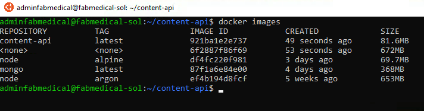

4. Navigate to the `content-web` folder again and list the files.  Note that this folder already has a `Dockerfile`.

    ```bash
    cd ..
    cd content-web
    ll
    ```

5. View the `Dockerfile` contents, which are similar to the file you created previously in the `content-api` folder.  Type the following command:

    ```bash
    cat Dockerfile
    ```

    Notice that the `content-web` Dockerfile build stage includes additional tools to install `bower` packages in addition to the `npm` packages.

6. Type the following command to create a Docker image for the web application.

    ```bash
    docker build -t content-web .
    ```

7. When complete, you will see three images now exist when you run the Docker images command.

    ```bash
    docker images
    ```

    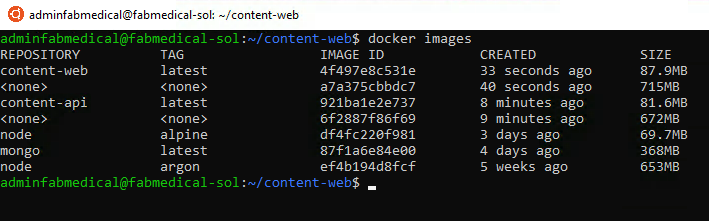

### Task 5: Run a containerized application

The web application container will be calling endpoints exposed by the API application container.  In this exercise, you will create a bridge network so that containers can communicate with one another, and then launch the images you created as containers in that network.

1. From WSL, type the following command to create a Docker network `fabmedical`.

    ```bash
    docker network create fabmedical
    ```

2. Create and start the `api` application container with the following command.  The command does the following:

    - Names the container "api" for later reference with Docker commands.

    - Instructs the Docker engine to use the "fabmedical" network.

    - Instructs the Docker engine to use port 3001 and map that to the internal container port 3001.

    - Creates a container from the specified image, by its tag, such as `content-api`.

    ```bash
    docker run -d --name api --net fabmedical -p 3001:3001 content-api
    ```

3. Enter the command to show running container.  You should observe that the `api` container is in the list.

    ```bash
    docker container ls
    ```

    

4. Test the `api` by curling the URL.  You will see JSON output as you did when testing previously.

    ```bash
    curl http://localhost:3001/speakers
    ```

5. Create and start the `web` application container with a similar Docker `run` command - instruct the docker engine to use any port with the `-P` command:

    ```bash
    docker run -d -P --name web --net fabmedical content-web
    ```

6. Enter the command to show running containers again and you'll observe that both the `api` and `web` containers are in the list.  The `web` container shows a dynamically assigned port mapping to its internal container port 3000.

    ```bash
    docker container ls
    ```

    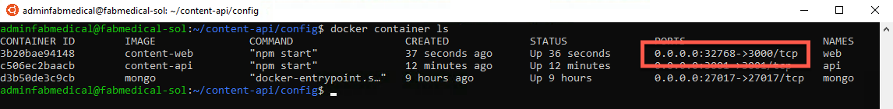

7. Test the `web` application by curling the URL.  For the port, use the dynamically assigned port, which you can find in the output from the previous command.  You will see HTML output, as you did when testing previously.

    ```bash
    curl http://localhost:[PORT]/speakers.html
    ```

### Task 6: Setup environment variables

In this task, you will configure the `web` container to communicate with the `api` ontainer using an environment variable.  You will modify the web application to read the URL from the environment variable, rebuild the Docker image, and then run the container again to test connectivity.

1. From WSL, stop and remove the `web` container using the following commands.

    ```bash
    docker stop web
    docker rm web
    ```

2. Validate that the `web` container is no longer running or present by using the `-a` flag as shown in the following command.  You will see that the `web` container is no longer listed.

    ```bash
    docker container ls -a
    ```

3. Navigate to the `content-web/data-access` directory.  From there, open the `index.js` file for editing using Vim and press the `i` key to go into edit mode.

    ```bash
    cd data-access
    vi index.js
    <i>
    ```

4. Locate the following `TODO` item and modify the code to comment the first line and uncomment the second.  The result is that the `contentApiUrl` variable will be set to an environment variable.

    ```javascript
    //TODO:
    //var contentApiUrl = "http://localhost:3001"
    var contentApiUrl = process.env.CONTENT_API_URL
    ```

5. Press the `ESCAPE` key and type `:wq` and then press the `ENTER` key to save and close the file.

    ```text
    <ESC>
    :wq
    <ENTER>
    ```

6. Navigate to the `content-web` directory.  From there, open the `Dockerfile` for editing using Vim and press the `i` key to go into edit mode.

    ```bash
    cd ..
    vi Dockerfile
    <i>
    ```

7. Locate the `EXPOSE` line shown below and add a line above it that sets the environment variable as shown in the screenshot.

    ```Dockerfile
    ENV CONTENT_API_URL http://localhost:3001
    ```

    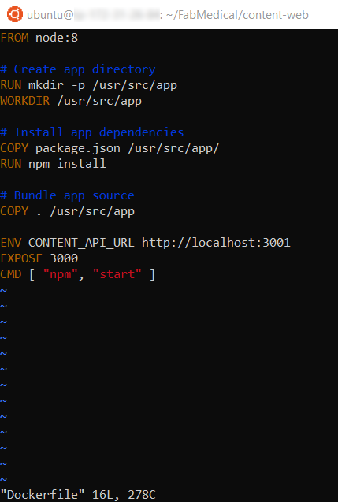

8. Press the `ESCAPE` key and type `:wq` and then press the `ENTER` key to save and close the file.

    ```text
    <ESC>
    :wq
    <ENTER>
    ```

9. Rebuild the `web` application Docker image using the same command as you did previously.

    ```bash
    docker build -t content-web .
    ```

10. Create and start the image passing the correct URI to the `api` container as an environment variable.  This variable will address the `api` application using its container name over the Docker network you created.  After running the container, check to see that the container is running and note the dynamic port assignment for the next step.

    >**NOTE: The `docker run` command is all one line and ends with `content-web`**

    ```bash
    docker run -d -P --name web --net fabmedical -e CONTENT_API_URL=http://api:3001 content-web

    docker container ls
    ```

11. Curl the `speakers` path again, using the port assigned to the `web` container.  This time you will see HTML returned.

    ```bash
    curl http://localhost:[PORT]/speakers.html
    ```

12. You will not be able to browse the `web` application unless the agent VM exposes the port.  Now you will stop the web container and restart it using port 3000 to test in the browser.  To do this, type the following commands to stop the container, remove it, and run it again using explicit settings for the port.

    >**NOTE: The `docker run` command is all one line and ends with `content-web`**

    ```bash
    docker stop web
    docker rm web
    docker run -d -p 3000:3000 --name web --net fabmedical -e CONTENT_API_URL=http://api:3001 content-web
    ```

13. Curl the `speakers` path again, using port 3000.  You will see the same HTML returned.

    ```bash
    curl http://localhost:3000/speakers.html
    ```

14. You can now use a web browser to navigate to the website and successfully view the application at port 3000.  Replace `[BUILDAGENTIP]` with the IP address you used previously.

    ```bash
    http://[BUILDAGENTIP]:3000

    EXAMPLE: http://13.68.113.176:3000
    ```

### Task 7: Push images to DockerHub

To run containers in a remote environment, you will typically push images to a Docker registry where you can store and distribute images.  Each service will have a repository that can be pushed to and pulled from with Docker commands.  DockerHub provides a public registry that is easy to test with - and most production environments will stand up a hosted version of Docker registry that is managed by a third party or manage their own production worthy registry.

In this task, you will push images to your DockerHub account, version images with tagging, and run containers from an image in your DockerHub.

1. In a browser, log into your DockerHub account created previously at https://hub.docker.com.  Keep this handy as you perform actions on the build VM.

2. From WSL, login to your DockerHub account by typing the following command.  Follow the instructions to complete the login.

    ```bash
    docker login
    ```

3. Run the following commands to properly tag your images to match your DockerHub ACR account name.  The example below shows the resulting commands if your DockerHub account was named `fabmedical` - please make sure to use your own DockerHub account name.

    ```bash
    docker tag content-web [DOCKERHUBACCOUNT]/content-web
    docker tag content-api [DOCKERHUBACCOUNT]/content-api

    EXAMPLE:
    docker tag content-web fabmedical/content-web
    docker tag content-api fabmedical/content-api
    ```

4. Validate that your images are properly tagged to match your account name per the instructions in previous tasks.  List your Docker images and look at the repository and tag.

5. Push the images to your DockerHub account with the following commands.

    ```bash
    docker push [DOCKERHUBACCOUNT]/content-web
    docker push [DOCKERHUBACCOUNT]/content-api
    ```

6. From the browser, navigate to your DockerHub account and refresh the page.  You will now see two repositories created, one for each image.  Note: It may take some time for the DockerHub site to update the state of your repository.  If the push image commands succeeded but you do not see the repository or your images on the **Repositories** page for your account, you can continue - you just won't be able to check the status of your repository or images through the DockerHub site.

7. Click on the `content-web` repository and select the **Tags** tab to view the tags assigned to the image.  You'll see the `latest` tag is assigned.

8. From WSL, assign the `v1` tag to each image with the following commands.  Then list the Docker images to note that there are now two entries for each image: the `latest` tagged image and the `v1` tagged image.  Also, note that the image ID is the same for the two entries, as there is only one physical copy of the image.

    ```bash
    docker tag [DOCKERHUBACCOUNT]/content-web:latest [DOCKERHUBACCOUNT]/content-web:v1
    docker tag [DOCKERHUBACCOUNT]/content-api:latest [DOCKERHUBACCOUNT]/content-api:v1
    docker images
    ```

9. Repeat *Step 4* to push the images to DockerHub again.  Then, refresh one of the repositories to see that two versions of the image now appear.

10. Run the following commands to pull an image from the repository.  Note that the default behavior is to pull images tagged with `latest`.  You can pull a specific version using the version tag.  Also, note that since the images already exist on the build agent, nothing is downloaded.

    ```bash
    docker pull [DOCKERHUBACCOUNT]/content-web
    docker pull [DOCKERHUBACCOUNT]/content-web:v1
    ```

## Exercise 3: Deploy the solution to AWS Elastic Kubernetes Service

**Duration**: 30 minutes

In this exercise, you will connect to the Kubernetes cluster you created in the AWS Elastic Kubernetes Service before the hands-on lab and deploy the Docker application to the cluster using Kubernetes.

### Task 1: The Elastic Kubernetes Service cluster

In this task, you will gather the information you need about your Elastic Kubernetes Service cluster to connect to the cluster and execute commands to connect to the Kubernetes management dashboard from your local machine.

1. From the WSL while connected to the build agent, test that the configuration for the Kubernetes cluster that you set up prior to the lab is correct by running a simple `kubectl` command to produce a list of nodes.

    ```bash
    kubectl get nodes
    ```

    

2. Check the installation of the Kubernetes CLI (`kubectl`) by running the following command:

    ```bash
    kubectl version
    ```

    

3. Deploy the Kubernetes dashboard to your cluster.

    ```bash
    kubectl apply -f https://raw.githubusercontent.com/kubernetes/dashboard/v1.10.1/src/deploy/recommended/kubernetes-dashboard.yaml
    ```

    Output:

    ```text
    secret "kubernetes-dashboard-certs" created
    serviceaccount "kubernetes-dashboard" created
    role "kubernetes-dashboard-minimal" created
    rolebinding "kubernetes-dashboard-minimal" created
    deployment "kubernetes-dashboard" created
    service "kubernetes-dashboard" created
    ```

4. Deploy `heapster` to enable container cluster monitoring and performance analysis on your cluster.

    ```bash
    kubectl apply -f https://raw.githubusercontent.com/kubernetes/heapster/master/deploy/kube-config/influxdb/heapster.yaml
    ```

    Output:

    ```text
    serviceaccount "heapster" created
    deployment "heapster" created
    service "heapster" created
    ```

5. Deploy the `influxdb` backend for `heapster` for your cluster.

    ```bash
    kubectl apply -f https://raw.githubusercontent.com/kubernetes/heapster/master/deploy/kube-config/influxdb/influxdb.yaml
    ```

    Output:

    ```text
    deployment "monitoring-influxdb" created
    service "monitoring-influxdb" created
    ```

6. Create the `heapster` cluster role binding for the dashboard.

    ```bash
    kubectl apply -f https://raw.githubusercontent.com/kubernetes/heapster/master/deploy/kube-config/rbac/heapster-rbac.yaml
    ```

    Output:

    ```text
    clusterrolebinding "heapster" created
    ```

7. Create a file called `eks-admin-service-account.yaml` with the text below. This manifest defines a service account and cluster role binding called `eks-admin`.

    a. Create the `eks-admin-service-account.yaml` in Vim and press `i` to enter `INSERT` mode.

    ```bash
    vi eks-admin-service-account.yaml
    <i>
    ```

    b. Enter the following YAML definition into the Vim editor.

    ```yaml
    apiVersion: v1
    kind: ServiceAccount
    metadata:
      name: eks-admin
      namespace: kube-system
    ---
    apiVersion: rbac.authorization.k8s.io/v1beta1
    kind: ClusterRoleBinding
    metadata:
      name: eks-admin
    roleRef:
      apiGroup: rbac.authorization.k8s.io
      kind: ClusterRole
      name: cluster-admin
    subjects:
    - kind: ServiceAccount
      name: eks-admin
      namespace: kube-system
    ```

    c. Save the file by pressing `ESCAPE` and typing `:wq` and pressing `ENTER`

    ```vim
    <ESC>
    :wq
    <ENTER>
    ```

8. Apply the service account and cluster role binding to your cluster.

    ```bash
    kubectl apply -f eks-admin-service-account.yaml
    ```

    Output:

    ```text
    serviceaccount "eks-admin" created
    clusterrolebinding.rbac.authorization.k8s.io "eks-admin" created
    ```

9. Retrieve an authentication token for the eks-admin service account. Copy the `<authentication_token>` value from the output. You use this token to connect to the dashboard.

    ```bash
    kubectl -n kube-system describe secret $(kubectl -n kube-system get secret | grep eks-admin | awk '{print $1}')
    ```

    Output:

    ```text
    Name:         eks-admin-token-b5zv4
    Namespace:    kube-system
    Labels:       <none>
    Annotations:  kubernetes.io/service-account.name=eks-admin
                  kubernetes.io/service-account.    uid=bcfe66ac-39be-11e8-97e8-026dce96b6e8

    Type:  kubernetes.io/service-account-token

    Data
    ====
    ca.crt:     1025 bytes
    namespace:  11 bytes
    token:      <authentication_token>
    ```

10. Start the `kubectl proxy`

    ```bash
    kubectl proxy
    ```

11. Open a new WSL window and use `ssh` to tunnel port 8001 to localhost.

    ```bash
    ssh -i .ssh/[PRIVATEKEYNAME] -L 8001:localhost:8001 [BUILDAGENTUSERNAME]@[BUILDAGENTIP]
    ```

12. Open the following link with a web browser to access the dashboard endpoint:

    ```text
    http://localhost:8001/api/v1/namespaces/kube-system/services/https:kubernetes-dashboard:/proxy/#!/login
    ```

13. Choose **Token**, paste the `<authentication_token>` output from the previous command into the **Token** field, and choose **SIGN IN**.

    

> **Note**: It may take a few minutes before CPU and memory metric appear in the dashboard.

### Task 2: Deploy a service using the Kubernetes management dashboard

In this task, you will deploy the API application to the Elastic Kubernetes Service cluster using the Kubernetes dashboard.

1. From the Kubernetes dashboard, select **Create** in the top right corner.

2. From the **Resource Creation** view, select the **Create an App** tab.

    

    - Enter `api` for the App name.

    - Enter [DOCKERHUBACCOUNT]/content-api for the Container Image, replacing [DOCKERHUBACCOUNT] with your DockerHub account name, such as `fabmedical`.

    - Set Number of pods to 1.

    - Set Service to `Internal`.

    - Use 3001 for Port and 3001 for Target port.

3. Select **SHOW ADVANCED OPTIONS**

    - Enter `0.125` for the CPU requirement.

    - Enter `128` for the Memory requirement.

    

4. Select **Deploy** to initiate the service deployment based on the image. This can take a few minutes.  In the meantime, you will be redirected to the **Overview** dashboard.  Select the `api` deployment from the **Overview** dashboard to see the deployment in progress.

    

5. Next, download the `api` deployment configuration using the following command in your WSL window while connected to the build agent VM:

    ```bash
    kubectl get -o=yaml --export=true deployment api > api.deployment.yml
    ```

    Contents of resulting `api.deployment.yml`:

    ```yaml
    apiVersion: extensions/v1beta1
    kind: Deployment
    metadata:
    annotations:
        deployment.kubernetes.io/revision: "1"
    creationTimestamp: null
    generation: 1
    labels:
        k8s-app: api
    name: api
    selfLink: /apis/extensions/v1beta1/namespaces/default/deployments/api
    spec:
    progressDeadlineSeconds: 600
    replicas: 1
    revisionHistoryLimit: 10
    selector:
        matchLabels:
        k8s-app: api
    strategy:
        rollingUpdate:
        maxSurge: 25%
        maxUnavailable: 25%
        type: RollingUpdate
    template:
        metadata:
        creationTimestamp: null
        labels:
            k8s-app: api
        name: api
        spec:
        containers:
        - image: fabmedical/content-api
            imagePullPolicy: Always
            name: api
            resources:
            requests:
                cpu: 125m
                memory: 128Mi
            securityContext:
            privileged: false
            terminationMessagePath: /dev/termination-log
            terminationMessagePolicy: File
        dnsPolicy: ClusterFirst
        restartPolicy: Always
        schedulerName: default-scheduler
        securityContext: {}
        terminationGracePeriodSeconds: 30
    ```

6. Select **Deployments** and then `api` in the Kubernetes dashboard to view the `api` deployment.  It now has a healthy instance.

### Task 3: Deploy a service using kubectl

In this task, deploy the `web` service using `kubectl`.

1. Open a **new** WSL console window and SSH into the build agent VM.

2. Create a text file called `web.deployment.yml` using Vim and press the `i` key to go into edit mode.

    ```bash
    vi web.deployment.yml
    <i>
    ```

3. Copy and paste the following text into the editor:

    >**NOTE: Be sure to copy and paste only the contents of the code block carefully to avoid introducing any special characters.**

    ```yaml
    apiVersion: extensions/v1beta1
    kind: Deployment
    metadata:
      labels:
          app: web
      name: web
    spec:
      replicas: 1
      selector:
          matchLabels:
            app: web
      strategy:
          rollingUpdate:
            maxSurge: 1
            maxUnavailable: 1
          type: RollingUpdate
      template:
          metadata:
            labels:
                app: web
            name: web
          spec:
            containers:
            - image: [DOCKERHUBACCOUNT]/content-web
              env:
                - name: CONTENT_API_URL
                  value: http://api:3001
              livenessProbe:
                httpGet:
                    path: /
                    port: 3000
                initialDelaySeconds: 30
                periodSeconds: 20
                timeoutSeconds: 10
                failureThreshold: 3
              imagePullPolicy: Always
              name: web
              ports:
                - containerPort: 3000
                  hostPort: 80
                  protocol: TCP
              resources:
                requests:
                    cpu: 1000m
                    memory: 128Mi
              securityContext:
                privileged: false
              terminationMessagePath: /dev/termination-log
              terminationMessagePolicy: File
            dnsPolicy: ClusterFirst
            restartPolicy: Always
            schedulerName: default-scheduler
            securityContext: {}
            terminationGracePeriodSeconds: 30
    ```

4. Edit this file and update the [DOCKERHUBACCOUNT] entry to match the name of your DockerHub account name (`fabmedical`, for example).

5. Press the `ESCAPE` key and type `:wq`.  Then press the `ENTER` key to save and close the file.

    ```text
    <ESC>
    :wq
    <ENTER>
    ```

6. Create a text file called `web.service.yml` using Vim, and press the `i` key to go into edit mode.

    ```bash
    vi web.service.yml
    <i>
    ```

7. Copy and paste the following text into the editor:

    >**NOTE: Be sure to copy and paste only the contents of the code block carefully to avoid introducing any special characters.**

    ```yaml
    apiVersion: v1
    kind: Service
    metadata:
      labels:
          app: web
      name: web
    spec:
      ports:
        - name: web-traffic
          port: 80
          protocol: TCP
          targetPort: 3000
      selector:
          app: web
      sessionAffinity: None
      type: LoadBalancer
    ```

8. Press the `ESCAPE` key and type `:wq`. Then press the `ENTER` key to save and close the file.

9. Type the following command to deploy the application described by the YAML files.  You will receive a message indicating that `kubectl` has created a `web` deployment and a `web` service.

    ```bash
    kubectl create --save-config=true -f web.deployment.yml -f web.service.yml
    ```

    

10. Return to the browser where you have the Kubernetes management dashboard open.  From the navigation menu, select the **Services** view under **Discovery and Load Balancing**.  From the **Services** view, select the `web` service and from this view you will see the `web` service deploying.  This deployment can take a few minutes.  When it completes, you should be able to access the website via an external endpoint, the link to which should be accessible in the **External Endpoints** value visible in the **Details** section of the `web` service information - you should open this external endpoint link in your browser at this time.

    

### Task 4: Test the application in a browser

In this task, you will verify that you can browse to the `web` service you have deployed and view the speaker and session content information exposed by the `api` service.

1. From the Kubernetes management dashboard, in the navigation menu, select the Services view under Discovery and Load Balancing.

2. In the list of services, locate the external endpoint for the web service and select this hyperlink to launch the application.

    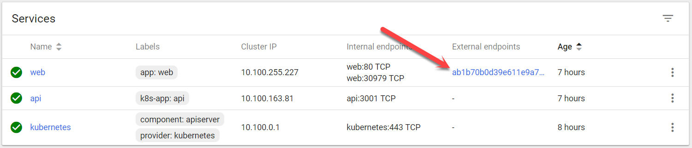

3. You will see the web application in your browser and be able to select the Speakers and Sessions links to view those pages without errors. The lack of errors means that the web application is correctly calling the API service to show the details on each of those pages.

    

    

## Exercise 4: Scale the application and test HA

**Duration**: 20 minutes

At this point you have deployed a single instance of the `web` and `api` service containers.  In this exercise, you will increase the number of container instances for the `api` services and scale the back end on the existing cluster.

### Task 1: Increase service instances from the Kubernetes dashboard

In this task, you will increase the number o instances for the `api` deployment in the Kubernetes management dashboard.  While it is deploying, you will observe the changing status.

1. From the navigation menu, select **Workloads \> Deployments**, and then select the `api` deployment.

2. Select **SCALE**.

    

3. Change the number of pods to 2, and then select **OK**.

    

    >**NOTE: If the deployment completes quickly, you may not see the deployment Waiting states in the dashboard as described in the following steps**.

4. From the **Replica Set** view for the `api` deployment, you'll see it is now deploying and that there is one healthy instance and one pending instance.

    

5. From the navigation menu, select **Deployments** from the list. Note that the `api` service has a pending status indicated by the grey timer icon and it shows a pod count 1 of 2 instances (shown as "1/2").

    

6. From the **Navigation** menu, select **Workloads**. From this view, note that the health overview in the right panel of this view. You'll see the following:

    - One deployment and one replica set are each healthy for the api service.

    - One replica set is healthy for the web service.

    - Three pods are healthy.

7. Navigate to the `web` application from the browser again. The application should still work without errors as you navigate to Speakers and Sessions pages

    - Navigate to the `/stats.html` page. You'll see information about the environment including:

        - **webTaskId:** The task identifier for the web service instance.

        - **taskId:** The task identifier for the API service instance.

        - **hostName:** The hostname identifier for the API service instance.

        - **pid:** The process id for the API service instance.

        - **mem:** Some memory indicators returned from the API service instance.

        - **counters:** Counters for the service itself, as returned by the `api` service instance.

        - **uptime:** The up time for the `api` service.

    - Refresh the page in the browser, and you can see the hostName change between the two `api` service instances. The letters after "api-{number}" in the hostname will change.

### Task 2: Increase service instances beyond available resources

In this task, you will try to increase the number of instances for the `api` service container beyond available resources in the cluster. You will observe how Kubernetes handles this condition and correct the problem.

1. From the navigation menu, select **Deployments**. From this view, select the `api` deployment.

2. Configure the deployment to use a fixed host port for initial testing. Select **Edit**.

    

3. In the **Edit a Deploymen**t dialog, you will see a list of settings shown in JSON format. Use the copy button to copy the text to your clipboard.

    

4. Paste the contents into the text editor of your choice (notepad is shown here, MacOS users can use TextEdit).

    

5. Scroll down about half way to find the node `$.spec.template.spec.containers[0]`, as shown in the screenshot below.

    ![Screenshot of the deployment JSON code, with the `\$.spec.template.spec.containers\[0\]` section highlighted.](images/exercise4task2step5.png)

6. The containers spec has a single entry for the `api` container at the moment. You'll see that the name of the container is "api" - this is how you know you are looking at the correct container spec.

    - Add the following JSON snippet below the "name" property in the container spec:

      ```json
      "ports": [
          {
            "containerPort": 3001,
            "hostPort": 3001
          }
      ],
      ```

    - Your container spec should now look like this:

      ![Screenshot of the deployment JSON code, with the \$.spec.template.spec.containers\[0\] section highlighted, showing the updated values for containerPort and hostPost, both set to port 3001.](images/exercise4task2step6.png)

7. Copy the updated JSON document from notepad into the clipboard. Return to the Kubernetes dashboard, which should still be viewing the `api` deployment.

    - Select **Edit**.

      

    - Paste the updated JSON document.

    - Select **Update**.

      

8. From the `api` deployment view, select **Scale**.

    

9. Change the number of pods to 4 and select **OK**.

    

10. From the navigation menu, select **Services** view under **Discovery and Load Balancing**. Select the `api` service from the **Services** list. From the `api` service view, you'll see it has two healthy instances and two unhealthy (or possibly pending depending on timing) instances.

    

11. After a few minutes, select **Workloads** from the navigation menu. From this view, you should see an alert reported for the `api` deployment.

    

    >**NOTE: This message indicates that there weren't enough available resources to match the requirements for a new pod instance. In this case, this is because the instance requires port 3001, and since there are only 2 nodes available in the cluster, only two `api` instances can be scheduled. The third and fourth pod instances will wait for a new node to be available that can run another instance using that port.**

12. Reduce the number of requested pods to 2 using the **Scale** button.

13. Almost immediately, the warning message from the **Workloads** dashboard should disappear, and the `api` deployment will show 2/2 pods are running.

    

### Task 3: Restart containers and test HA

In this task, you will restart containers and validate that the restart does not impact the running service.

1. From the navigation menu on the left, select **Services** view under **Discovery and Load Balancing**. From the **Services** list, select the external endpoint hyperlink for the `web` service, and visit the stats page by adding `/stats.html` to the URL. Keep this open and handy to be refreshed as you complete the steps that follow.

    

    

2. From the navigation menu, select **Workloads \> Deployments**. From **Deployments** list, select the `api` deployment.

    

3. From the `api` deployment view, select **Scale** and from the dialog presented, and enter 4 for the desired number of pods. Select **OK**.

4. From the navigation menu, select **Workloads \> Replica Sets**. Select the `api` replica set and, from the **Replica Set** view, you will see that two pods cannot deploy.

    

5. Return to the browser tab with the `web` application stats page loaded. Refresh the page over and over. You will not see any errors, but you will see the `api` host name change between the two `api` pod instances periodically. The `task id` and `pid` might also change between the two `api` pod instances.

    

6. After refreshing enough times to see that the `hostName` value is changing and the service remains healthy, return to the **Replica Sets** view for the `api`. From the navigation menu, select **Replica Sets** under **Workloads** and select the `api` replica set.

7. From this view, take note that the `hostName` value shown in the `web` application stats page matches the pod names for the pods that are running.

    

8. Note the remaining pods are still pending, since there are not enough port resources available to launch another instance. Make some room by deleting a running instance. Select the context menu and choose **Delete** for one of the healthy pods.

    

9. Once the running instance is gone, Kubernetes will be able to launch one of the pending instances. However, because you set the desired size of the deploy to 4, Kubernetes will add a new pending instance. Removing a running instance allowed a pending instance to start, but in the end, the number of pending and running instances is unchanged.

    

10. From the navigation menu, select **Deployments** under **Workloads**. From the view's **Deployments** list select the `api` deployment.

11. From the `api` Deployment view, select **Scale** and enter 1 as the desired number of pods. Select **OK**.

    

12. Return to the web site's `stats.html` page in the browser and refresh while this is scaling down. You'll notice that only one `api` host name shows up, even though you may still see several running pods in the `api` replica set view. Even though several pods are running, Kubernetes will no longer send traffic to the pods it has selected to scale down. In a few moments, only one pod will show in the `api` replica set view.

    

13. From the navigation menu, select **Workloads**. From this view, note that there is only one `api` pod now.

    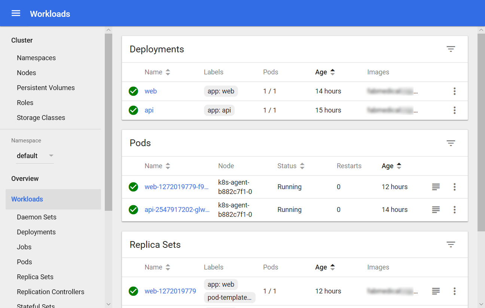

## Exercise 5: Setup load balancing and service discovery

**Duration**: 45 minutes

In the previous exercise we introduced a restriction to the scale properties of the service. In this exercise, you will configure the `api` deployments to create pods that use dynamic port mappings to eliminate the port resource constraint during scale activities.

Kubernetes services can discover the ports assigned to each pod, allowing you to run multiple instances of the pod on the same agent node --- something that is not possible when you configure a specific static port (such as 3001 for the `API` service).

### Task 1: Scale a service without port constraints

In this task, we will reconfigure the `api` deployment so that it will produce pods that choose a dynamic `hostPort` for improved scalability.

1. From the navigation menu select **Deployments** under **Workloads**. From the view's **Deployments** list select the `api` deployment.

2. Select **Edit**.

3. From the **Edit a Deployment** dialog, do the following:

    - Scroll to the first spec node that describes replicas as shown in the screenshot. Set the value for replicas to 4.

    - Within the replicas spec, beneath the template node, find the "api" containers spec as shown in the screenshot. Remove the hostPort entry for the `api` container's port mapping.

        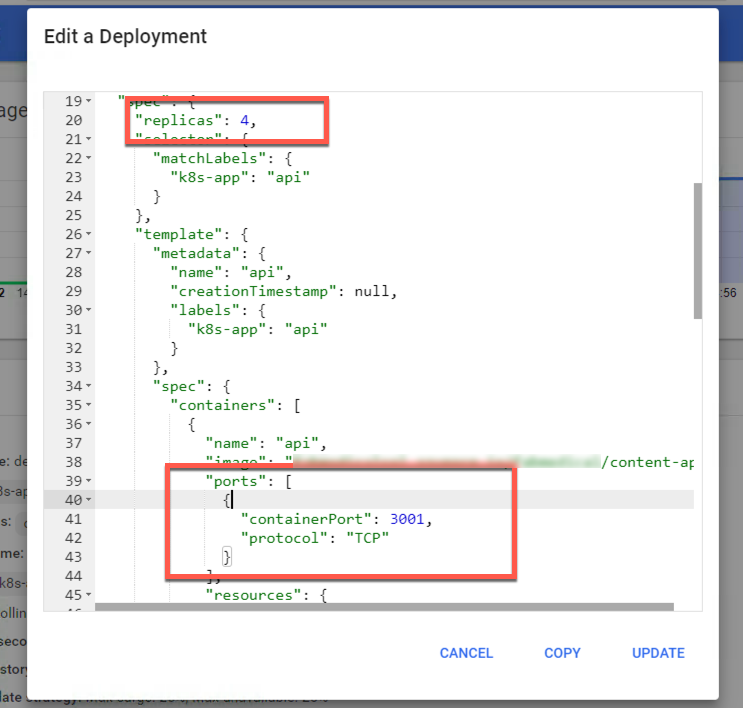

4. Select **Update**. New pods will now choose a dynamic port.

5. The `api` service can now scale to 4 pods since it is no longer constrained to an instance per node -- a previous limitation while using port 3001.

    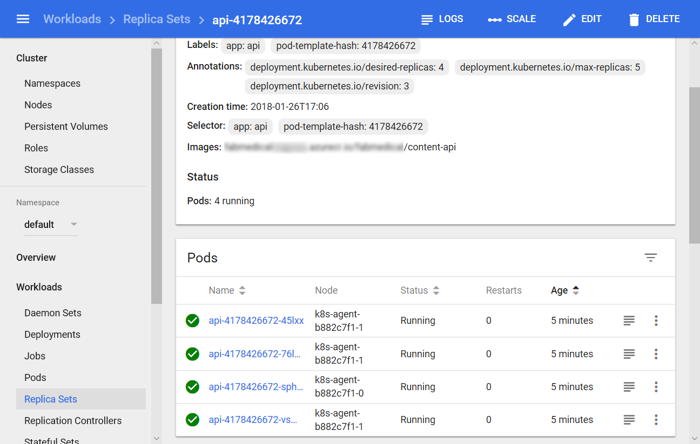

6. Return to the browser and refresh the `stats.html` page. You should see all 4 pods serve responses as you refresh.

### Task 2: Update an external service to support dynamic discovery with a load balancer

In this task, you will update the `web` service so that it supports dynamic discovery through the AWS load balancer.

1. From the navigation menu, select **Deployments** under **Workloads**. From the view's **Deployments** list select the `web` deployment.

2. Select **Edit**.

3. From the **Edit a Deployment** dialog, scroll to the `web` containers spec as shown in the screenshot. Remove the `hostPort` entry for the `web` container's port mapping.

    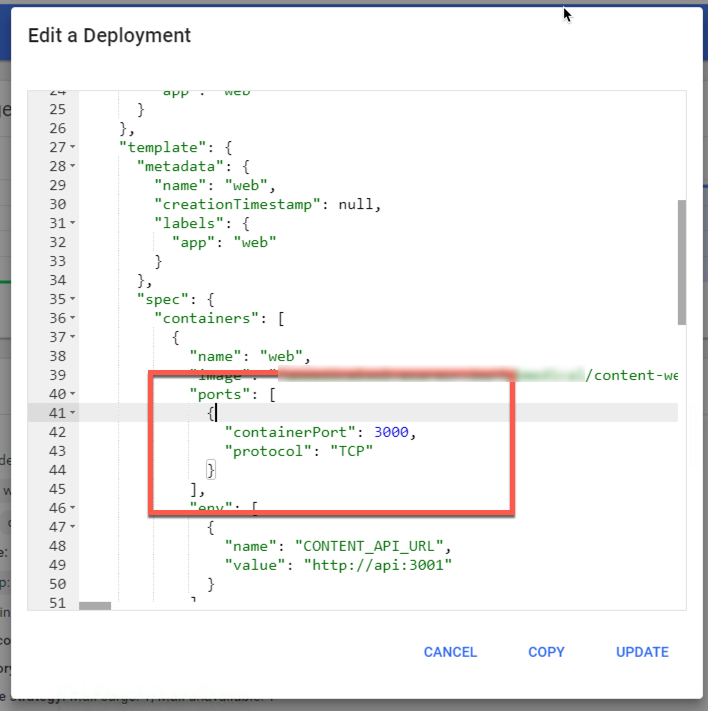

4. Select **Update**.

5. From the `web` **Deployments** view, select **Scale**. From the dialog presented enter 4 as the desired number of pods and select **OK**.

6. Check the status of the scale out by refreshing the `web` deployment's view. From the navigation menu, select **Deployments** from under **Workloads**. Select the `web` deployment. From this view, you should see an error like that shown in the following screenshot.

    

Like the `api` deployment, the `web` deployment used a fixed *hostPort*, and your ability to scale was limited by the number of available agent nodes. However, after resolving this issue for the `web` service by removing the *hostPort* setting, the `web` deployment is still unable to scale past two pods due to CPU constraints. The deployment is requesting more CPU than the `web` application needs, so you will fix this constraint in the next task.

### Task 3: Adjust CPU constraints to improve scale

In this task, you will modify the CPU requirements for the `web` service so that it can scale out to more instances.

1. From the navigation menu, select **Deployments** under **Workloads**. From the view's **Deployments** list select the `web` deployment.

2. Select **Edit**.

3. From the **Edit a Deployment** dialog, find the *cpu* resource requirements for the `web` container. Change this value to "125m".

    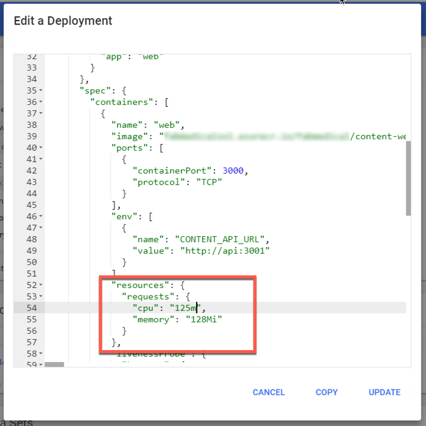

4. Select **Update** to save the changes and update the deployment.

5. From the navigation menu, select **Replica Sets** under **Workloads**. From the view's **Replica Sets** list select the `web` replica set.

6. When the deployment update completes, four `web` pods should be shown in running state.

    

7. Return to the browser tab with the `web` application loaded. Refresh the stats page at `/stats.html` to watch the display update to reflect the different `api` pods by observing the host name refresh.

## After the hands-on lab

**Duration**: 10 mins

1. Open the AWS CloudFormation console at https://console.aws.amazon.com/cloudformation.

2. Select each CloudFormation stack you created and select **Delete** from the **Action** dropdown to delete the stack.

    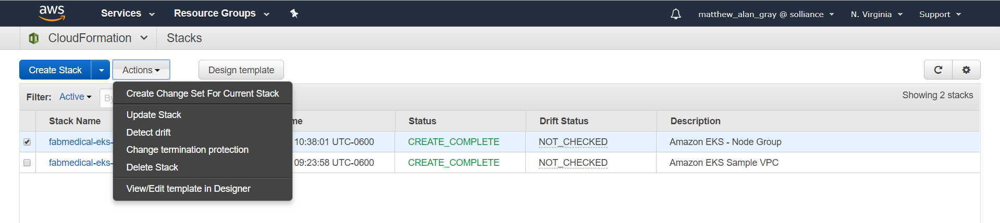

3. Wait until stack deletion is complete.
