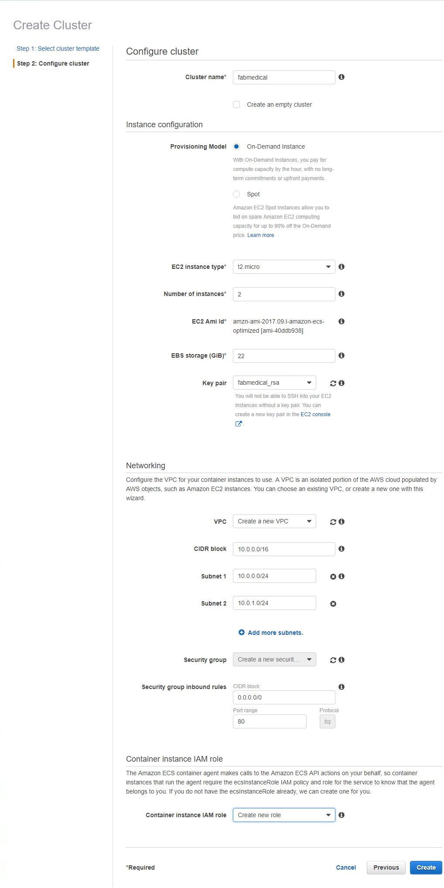

# AWS Lab Setup

> LAST UPDATED: 5/6/2018

This document describes all of the preparation you should take care of prior to the workshop.
If you do not have time, you may work on this during the workshop but may not complete as many lab steps
during lab times and can work on your own time to complete the lab at your leisure.

## Prerequisites

The lab will make use of several tools and services.  Here is a list of requirements that you will need to successfully complete the lab.  If you are missing any of these requirements, we will cover the steps to satisfy them in this document.

* An internet connection.
* Amazon Web Services Account.
  * You will need an email or mobile number
  * You will need to enter credit card information
* A DockerHub account
  * You will need an email address
* A browser, preferably Chrome for consistency with this guide.
* A command prompt (some commands will work in windows CMD but for consistency we will use bash by default).
  * You will need openssh at a minimum
  * You will need the aws cli

## Preparation Steps in this Document

**Create your AWS Account**

* Task 1: Create an Amazon Web Services account
* Task 2: Install WSL (Bash on Ubuntu on Windows)
* Task 3: Install AWS CLI 
* Task 4: Setup IAM Access

**Create a cluster and supporting tooling / setup (30 minutes)**

* Task 1: Create an SSH key
* Task 2: Upload public key to EC2
* Task 3: Create a build agent VM
* Task 4: Create an AWS Resource Group
* Task 5: Add Resource tag to the Security Group
* Task 6: Connect securely to the build agent
* Task 7: Complete the build agent setup
* Task 8: Create a Docker Hub account
* Task 9: Create an EC2 Container Service cluster
* Task 10: Download the sample source

## Create an AWS Account

### Task 1: Create an Amazon Web Services account

**Duration:** 20-30 minutes

1. Go to the account signup page: [https://aws.amazon.com](https://aws.amazon.com)

    * If you are new to this site it will show a button in the header "Create AWS Account", click this.
    * If you have been here before it will how a button in the header "Sign In to the Console", click this.

    To create your account (assuming you don't have one):

    * Enter email or mobile number.
    * Choose “I am a new user.”
    * Click “Sign in using our secure server”

    

2. Enter your name, and retype your email address. Choose a password.

    

3. Choose personal or company account. Then Fill out the required information. Click “Create Account and Continue”. **Tip: Do not include any whitespace when entering the CAPTCHA characters.**

    

4. Next enter payment information.

    

5. Next provide a telephone number so that Amazon can verify your identity.

    

    * When the call arrives, enter the pin as displayed

        

    * Now click “Continue”

        

6. Choose the basic support plan.

    

7. You should be returned to the AWS home page. Click “Sign In to the Console”

    

8. Now choose that you are a returning user and enter your password. Click the sign-in button.

    

9. You should be logged in to the console.

    

### Task 2: Install WSL (Bash on Ubuntu on Windows)

> NOTE: If you are using a Windows 10 development machine, follow these steps. For Mac OS you can ignore this step since you will be using Terminal for all commands.

You will need WSL to complete various steps. A complete list of instructions for supported Windows 10 versions is available on this page: [https://docs.microsoft.com/en-us/windows/wsl/install-win10](https://docs.microsoft.com/en-us/windows/wsl/install-win10)

### Task 3: Install AWS CLI

**Duration:** 5-10 minutes

**Instructions**
[http://docs.aws.amazon.com/cli/latest/userguide/installing.html#install-bundle-other-os](http://docs.aws.amazon.com/cli/latest/userguide/installing.html#install-bundle-other-os)

1. Check python install

    `$ python --version`

    > This should print out version info, otherwise you must install python.
    
    > WSL users: try `sudo apt update && sudo apt install python-minimal` if python is not found.

2. Download the installer:

    `$ curl "https://s3.amazonaws.com/aws-cli/awscli-bundle.zip" -o "awscli-bundle.zip"`

3. Unpack the bundle:

    `$ unzip awscli-bundle.zip`
    
    > WSL users: try `sudo apt install unzip` if this command fails

4. Run the installer:

    `$ sudo ./awscli-bundle/install -i /usr/local/aws -b /usr/local/bin/aws`

5. Test your installation:

    `$ aws --version`

    > This should print version information.

    

### Task 4: Setup IAM Access

**Duration:** 20-25 minutes

We will create an account admin for the purposes of running the examples in this workshop.
The account admin can be deleted after the workshop if you choose.

1. Login to the AWS console: [https://console.aws.amazon.com](https://console.aws.amazon.com)

2. Type IAM in the search box:

    

3. Click the search result to go to Identity and Access Management. Then click on “Users”

    

4. Click “Add user”

    

5. Enter “workshop-admin” as the user name. Choose “Programmatic access” as the access type. Click next.

    

6. Choose “Attach existing policies directly”, then search for the policy named “AdministratorAccess” check the checkbox next to the policy. Click next.

    

7. Review the configuration, then click “Create User”

    

    > **Important:** Amazon will only display the secret access key once--on this screen. Do not click close until you have captured the key.

    Click “Download .csv” and a file will download which contains the key.

    

    Alternatively, click “Show” and the key will be shown inline.

    

8. Now use the keys to configure the AWS cli.

    * Open your terminal/command prompt and run “aws configure”

        `$ aws configure`

        * Enter the Access Key ID when prompted.
        * Enter the Secret Access Key when prompted.
        * Use enter to accept the remaining defaults.

9. Test the configuration by describing ec2 instances.

    `$ aws ec2 describe-instances --region us-west-2`

10. There shouldn’t be any yet, but the command should succeed

    

## Before the Workshop

**Duration**: 30 minutes (possibly additional time if AWS provisioning is slower)

### Task 1: Create an SSH key

In this section, you will create an SSH key to securely access the VMs you create during the upcoming exercises.

1. Open a WSL command window.

    

    or

    

2. From the command line, enter the following command to ensure that a directory for the SSH keys is created. You can ignore any errors you see in the output.

    `mkdir .ssh`

3. From the command line, enter the following command to generate an SSH key pair. You can replace “admin” with your preferred name or handle.

    `ssh-keygen -t RSA -b 2048 -C admin@fabmedical`

4. You will be asked to save the generated key to a file. Enter ".ssh/fabmedical" for the name.
5. Enter a passphrase when prompted, and don’t forget it!
6. Because you entered “.ssh/fabmedical”, the file will be generated in the “.ssh” folder in your user folder, where WSL opens by default.
7. Keep this WSL window open and remain in the default directory you will use it in later tasks.

    

### Task 2: Upload public key to EC2

In this section, you will upload the public portion of the key pair you just created to EC2. This allows AWS to assign the key to resources as it creates them, which in turn allows you to authenticate with those resources using the private key.

1.  In your WSL terminal, run the following command to upload your public key material.

    > Note that this command will upload the key to `us-west-2`, if you would like to use a different region, be sure to update the command to reflect your preference.
    
    ```bash
    aws ec2 import-key-pair --key-name fabmedical_rsa --public-key-material "`cat .ssh/fabmedical.pub`" --region us-west-2
    ```

1. From the AWS Console type “EC2” in the services search box. Select the “EC2” search result.

    

1. On the EC2 Dashboard, click the “Key Pairs” item on the left menu.

    

1. Your key should now be available.

    

### Task 3: Create a build agent VM

In this section, you will create a Linux VM to act as your build agent. You will be installing Docker to this VM once it is set up and you will use this VM during the lab to develop and deploy.

> NOTE: You can set up your local machine with Docker however the setup varies for different versions of Windows. **For this** lab, the build agent approach simply allows for predictable setup.

1. Navigate to the EC2 Dashboard. On the EC2 Dashboard, click “Launch Instance”

    

2. Check the checkbox for “Free tier only” then choose “Ubuntu Server 16.04 LTS”.

    

3. Accept the default choice for instance type: t2.micro. Click Next.

    

4. Accept all the default parameters for “Step 3” and click Next.
5. Accept all the default parameters for “Step 4” and click Next.
6. Add a name tag with the value “build-agent”. Add another tag. Use “Resource” as the key and “fabmedical” as the value. Click Next.

    

7. In Step 6 we will create a security group, but we need to give it a proper name. Enter “fabmedical-build-agent” as the security group name and enter “Allow SSH access” as the description. Click “Review and Launch”.

    

8. Click launch to launch the VM. The final piece of configuration will be choosing the key pair you would like to use to access the VM. Choose “fabmedical\_rsa” the key you imported previously. You will not be able to click “Launch Instances” until you acknowledge that you have access to the private key.

    

9. The VM will begin deployment into your default VPC.

    

10. When the VM is provisioned you will see it in your list of instances.

    

### Task 4: Create an AWS Resource Group

1. Login to console.
2. Choose "Resource Groups" from the top menu bar.

   

3. Choose "Create a Resource Group"

   

4. Configure as described below, then click "Save".
    * Use "fabmedical Resources" as the group name.
    * For Tags, type "Resource" as the key and "fabmedical" as the value.

     

5. The Resource Group is created

   

### Task 5: Add Resource tag to the Security Group

In this section, you will add a Resource tag to the fabmedical-build-agent security group. Because we created the security group using the launch wizard, we were not able to set tags. This can make it easy to forget to clean up the security group, because it will not show up in a resource group search.

1. Navigate to EC2 and click on “Security Groups”

    

2. Select the security group with the group name “fabmedical-build-agent”

    

3. Click “Tags” in the bottom half of the screen. Then click “Add/Edit
    Tags”

    

4. Click “Create Tag”, then enter “Resource” as the key, and “fabmedical” as the value. Then click “Save”.

    

5. The resource tag appears in the list of the security group’s tag.

    

### Task 6: Connect securely to the build agent

In this section, you will validate that you can connect to the new build agent VM.

1. From the AWS Console, navigate to the Resource Group you created previously and select the new VM, build-agent. Click the “Go” link.

    

2. In the bottom portion of the EC2 instance list, take note of the public IP address for the VM.

    

3. From your WSL terminal, connect to the new VM you created by typing the following command.

    `ssh -i .ssh/[PRIVATEKEYNAME] [BUILDAGENTUSERNAME]@[BUILDAGENTIP]`

    Use the private key name such as “fabmedical\_rsa”, the username for the VM such as “ubuntu”, and the IP address for the build agent VM.

    `ssh -i .ssh/fabmedical ubuntu@52.34.187.56`

5. You will be asked to confirm if you want to connect, as the authenticity of the connection cannot be validated. Type “yes”.

6. You will be asked for the pass phrase for the private key you created previously. Enter this value.

7. You will now be connected to the VM with a command prompt such as the following. Keep this command prompt open for the next step.

    `ubuntu@ip-172-31-16-103:~$`

    

    > **NOTE: If you have issues connecting, you may have pasted the imported the SSH public key** **into EC2** **incorrectly.** **Unfortunately, if this is the case, you** **must** **retry the import, then try to create the VM again.**

### Task 7: Complete the build agent setup

In this task, you will update the packages and install Docker engine.

1. Go to the WSL window that has the SSH connection open to the build agent VM.
2. Update the Ubuntu packages and install curl and support for repositories over HTTPS in a single step by typing the following in a single line command. When asked if you would like to proceed, respond by typing “y” and pressing enter.

    `sudo apt-get update && sudo apt install apt-transport-https ca-certificates curl software-properties-common`

3. Add Docker’s official GPG key by typing the following in a single line command.

    `curl -fsSL https://download.docker.com/linux/ubuntu/gpg | sudo apt-key add -`

4. Add Docker’s stable repository to Ubuntu packages list by typing the following in a single line command.

    `sudo add-apt-repository "deb [arch=amd64] https://download.docker.com/linux/ubuntu $(lsb_release -cs) stable"`

5. Update the Ubuntu packages and install Docker engine, node.js and the node package manager in a single step by typing the following in a single line command. When asked if you would like to proceed, respond by typing “y” and pressing enter.

    `sudo apt-get update && sudo apt install docker-ce nodejs npm`

6. Now, upgrade the Ubuntu packages to the latest version by typing the following in a single line command. When asked if you would like to proceed, respond by typing “y” and pressing enter.

    `sudo apt-get upgrade`

7. When the command has completed, check the Docker version installed by executing this command. The output may look something like that shown in the following screen shot. Note that the server version is not shown yet, because you didn’t run the command with elevated privileges (to be addressed shortly).

    `docker version`
    

8. You may check the versions of node.js and npm as well, just for information purposes, using these commands.

    `nodejs --version`

    `npm -version`

9. Add your user to the Docker group so that you do not have to elevate privileges with sudo for every command. You can ignore any errors you see in the output.

    `sudo usermod -aG docker $USER`
    

10. In order for the user permission changes to take effect, exit the SSH session by typing ‘exit’, then press \<Enter>. Repeat the commands in Task 7: Connect securely to the build agent from step 4 to establish the SSH session again.
11. Run the Docker version command again, and note the output now shows the server version as well.

    

12. Run a few Docker commands.

    * One to see if there are any containers presently running

        `docker container ls`

    * One to see if any containers exist whether running or not

        `docker container ls -a`

13. In both cases, you will have an empty list but no errors running the command. Your build agent is ready with Docker engine running properly.

    

### Task 8: Create a Docker Hub account

Docker images are deployed from a Docker Registry.
To complete the lab, you will need access to a registry that is publicly accessible to the AWS Cloud cluster you are creating.
In this task, you will create a free Docker Hub account for this purpose, where you push images for deployment.

> NOTE: If you already have a public Docker Hub account you do not need to complete this task – you will need the name of the account for the exercises that rely on it.

1. Navigate to Docker Hub at [https://hub.docker.com](https://hub.docker.com).
2. Create a new Docker Hub account by providing a unique name for your Docker Hub ID, your email address for confirmation of the account, and a password.

    

3. Once you confirm your email address, you can sign in and confirm your Docker Hub account is ready.

    

4. Login to your Docker Hub account. If it is a new account, you will not see any repositories yet. You will create these during the lab.

    

### Task 9: Create an Elastic Container Service cluster

In this task, you will create your Elastic Container Service cluster. You will use the same SSH key you created previously to connect to this cluster in the next task.

1. From the AWS Console home page search for "container". Choose “Elastic Container Service”.

    

2. On the Elastic Container Service getting started page, click “Clusters” on the left hand menu.

    

3. Click "Create Cluster"

    

4. Choose the `EC2 Linux + Networking` cluster template then click "Next Step"

    > Note: As of this writing different AWS regions have different capabilities and UI versions, therefore screenshots may vary slightly depending on your region of choice.

    

5. Configure the cluster as described below then click "Create"
    * Cluster name: fabmedical    
    * Instance Configuration
        * Provisioning Model: On-Demand instance
        * EC2 Instance Type: Select t2.micro
        * Number of instances: 2
        * EBS storage (GiB): 22 
        * Key pair: Select fabmedical_rsa
    * Networking
        * VPC: Create a new VPC
        * CIDR block: 10.0.0.0/16
        * Subnet 1: 10.0.0.0/24
        * Subnet 2: 10.0.1.0/24
        * Security group inbound rules
            * CIDR block: 0.0.0.0/0
            * Port range: 80
    * Container instance IAM role: Create new role

    

6. Click "View Cluster" when the cluster deployment completes.

    

    > **NOTE: If you experience errors related to lack of available** **VMs, you may have to delete some other compute resources or request** **that Amazon raise the EC2 instance limit for your account. Changing to another region** **is a simple way around this limit, as the limit is assessed** **per region. Choose one of these options and try this again.**

### Task 10: Download the sample source

FabMedical has provided starter files for you. They have taken a copy of one of their web sites, for their customer Contoso Neuro, and refactored it from a single node.js site into a web site with a content API that serves up the speakers and sessions. This is a starting point to validate the containerization of their web sites. They have asked you to use this as the starting point for helping them complete a POC that helps to validate the development workflow for running the web site and API as Docker containers, and managing them within container platform.

1. From WSL, connect to the build agent VM as you did previously in Task 6.

2. Download the starter files to the build agent by typing the following curl instruction (case sensitive): 

    ```bash
    curl -L -o FabMedical.tgz https://bit.ly/2FSDtOz
    ```

3. Create a new directory named FabMedical by typing in the following command:

    ```bash
    mkdir FabMedical
    ```

4. Unpack the archive with the following command. This will extract the files from the archive to the FabMedical directory you created. The directory is case sensitive when you navigate to it.

    ```bash
    tar -C FabMedical -xzf FabMedical.tgz
    ```

    NOTE: Keep this WSL window open as your build agent SSH connection. During the lab you will later open new WSL sessions to other machines.

5. Navigate to FabMedical folder and list the contents.

    ```bash
    cd FabMedical
    ll
    ```

6. You’ll see the listing includes two folders, one for the web site and another for the content API.

    ```bash
    content-api/
    content-web/
    ```
