# Azure Container Service (AKS) Lab Setup

> LAST UPDATED: 4/26/2018

This document describes all of the preparation you should take care of prior to the workshop.
If you do not have time, you may work on this during the workshop but may not complete as many lab steps
during lab times and can work on your own time to complete the lab at your leisure.

## Prerequisites

The lab will make use of several tools and services.  Here is a list of requirements that you will need to successfully complete the lab.  If you are missing any of these requirements, we will cover the steps to satisfy them in this document.

* An internet connection.
* Microsoft Azure subscription must be pay-as-you-go or MSDN.
  * Trial subscriptions will not work.
  * You must have rights to create a service principal as discussed in Task 9: Create a Service Principal — and this typically requires a subscription owner to log in. You may have to ask another subscription owner to login to the portal and execute that step ahead of time if you do not have the rights.
  * You must have enough cores available in your subscription to create the build agent and Azure Container Service cluster in Task 5: Create a build agent VM and Task 10: Create an Azure Container Service cluster. You’ll need eight cores if following the exact instructions in the lab, more if you choose additional agents or larger VM sizes. If you execute the steps required before the lab, you will be able to see if you need to request more cores in your sub.
* Local machine or a virtual machine configured with:
  * A browser, preferably Chrome for consistency with the lab implementation tests
  * Command prompt
    * On Windows, you will be using Bash on Ubuntu on Windows, hereon referred to as WSL.
    * On Mac, all instructions should be executed using bash in Terminal.

> VERY IMPORTANT: You should be typing all of the commands as they appear in this document, except where explicitly stated. Do not try to copy and paste as there can be issues that result in errors, execution of instructions, or creation of file content.

## Preparation Steps in this Document

**Create your Azure Account**

> NOTE: remember that you have to complete Task 9: Create a Service Principal before you arrive to the workshop in case you do not have rights and need support to complete the task

**Create a cluster and supporting tooling / setup**

* Task 1: Create a new Resource Group
* Task 2: Create a Windows 10 Development VM (optional)
* Task 3: Install WSL (Bash on Ubuntu on Windows)
* Task 4: Create an SSH key
* Task 5: Create a build agent VM
* Task 6: Connect securely to the build agent
* Task 7: Complete the build agent setup
* Task 8: Create an Azure Container Registry
* Task 9: Create a Service Principal
* Task 10: Create an Azure Container Service cluster
* Task 11: Install Azure CLI
* Task 12: Install Kubernetes CLI

## Create Azure Account

1. Microsoft Azure subscription must be pay-as-you-go or MSDN. **(Trial subscriptions will not work)**

2. First login with your Microsoft Account then go to this link [https://azure.microsoft.com/en-us/pricing/purchase-options](https://azure.microsoft.com/en-us/pricing/purchase-options)

    

3. Then you will be directed to Azure sign up page where you have to provide your details

    

4. Once you fill your details and push purchase you will be directed to this page

    

5. Click on Get Started With your Azure subscription.

6. You are redirected to Azure portal

    

## Before the Workshop Setup

**Duration:** 1 hour ***(possibly additional time if Azure provisioning is slower)***

You should follow all of the steps provided in Exercise 0 before attending the lab.

### Task 1: Create a new Resource Group

You will create an Azure Resource Group to hold most of the resources that you create in this lab.
This approach will make it easier to clean up later. You will be instructed to create new resources in this Resource Group during the remaining exercises.

1. In your browser, navigate to the Azure Portal ([https://portal.azure.com](https://portal.azure.com)).

2. Select + Create a resource in the navigation bar at the left.

    

3. In the Search the Marketplace search box, type "Resource group" and press Enter.

    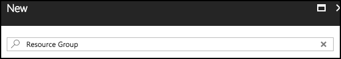

4. Select Resource group on the Everything blade and select Create.

    

5. On the new Resource group blade, set the following:

    * Resource group name: Enter something like “fabmedical-SUFFIX”, as shown in the following screenshot.
    * Subscription: Select the subscription you will use for all the steps during the lab.
    * Resource group location: Choose a region where all Azure Container Registry SKUs are available, which is currently East US, West Central US, or West Europe, and remember this for future steps so that the resources you create in Azure are all kept within the same region.

        

    * Select Create.

6. When this completes, your Resource Group will be listed in the Azure Portal.

    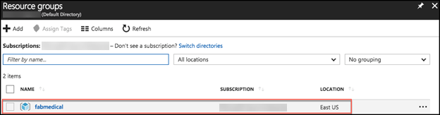

### Task 2: Create a Windows 10 Development VM (optional)

You will follow these steps to create a development VM (machine) for the following reasons:

* If your operating system is earlier than Windows 10 Anniversary Update, you will need it to work with WSL as instructed in the lab.
* If you are not sure if you set up WSL correctly, given there are a few ways to do this, it may be easier to create the development machine for a predictable experience.

> NOTE: Setting up the development machine is optional for Mac OS since you will use Terminal for commands. Setting up the development machine is also optional if you are certain you have a working installation of WSL on your current Windows 10 VM.

In this section, you will create a Windows 10 VM to act as your development machine. You will install the required components to complete the lab using this machine. You will use this machine instead of your local machine to carry out the instructions during the lab.

1. From the Azure Portal, select + Create a resource, type “Windows 10” in the Search the marketplace text box and press Enter.

    

2. Select Windows 10 Pro N, Version 1709 and select Create.
3. On the Basics blade of the Virtual Machine setup, set the following:

    * Name: Provide a unique name, such as “fabmedicald-SUFFIX” as shown in the following screenshot.
    * VM disk type: Leave as SSD.
    * User name: Provide a user name, such as “adminfabmedical”.
    * Password: Provide a password, such as “Password$123”.
    * Confirm password: Confirm the previously entered password.
    * Subscription: Choose the same subscription you are using for all your work.
    * Resource group: Choose Use existing and select the resource group you created previously.
    * Location: Choose the same region that you did before.
    * Select OK to complete the Basics blade.

        

4. From the Size blade, choose D2S_V2 Standard and Select.

    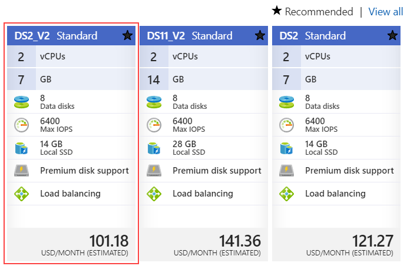

5. From the Settings blade, accept the default values for all settings and select OK.
6. From the Create blade, you should see that validation passed and select Create.

    

7. The VM will begin deployment to your Azure subscription.

    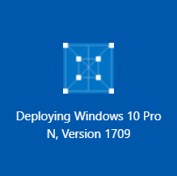

8. Once provisioned, you will see the VM in your list of resources belonging to the resource group you created previously and select the new VM.

    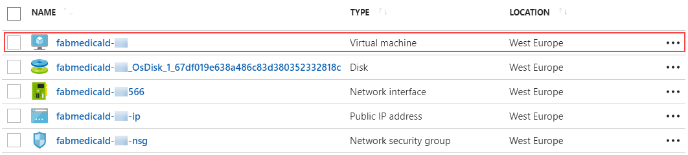

9. In the Overview area for the VM, select Connect to establish a Remote Desktop Connection (RDP) for the VM.

    

10. Complete the steps to establish the RDP session and ensure that you are connected to the new VM.

### Task 3: Install WSL (Bash on Ubuntu on Windows)

> NOTE: If you are using a Windows 10 development machine, follow these steps. For Mac OS you can ignore this step since you will be using Terminal for all commands.

You will need WSL to complete various steps. A complete list of instructions for supported Windows 10 versions is available on this page: [https://docs.microsoft.com/en-us/windows/wsl/install-win10](https://docs.microsoft.com/en-us/windows/wsl/install-win10)

### Task 4: Create an SSH key

In this section, you will create an SSH key to securely access the VMs you create during the upcoming exercises.

1. Open a WSL command window.

    

    or

    

2. From the command line, enter the following command to ensure that a directory for the SSH keys is created. You can ignore any errors you see in the output.

    `mkdir .ssh`

3. From the command line, enter the following command to generate an SSH key pair. You can replace “admin” with your preferred name or handle.

    `ssh-keygen -t RSA -b 2048 -C admin@fabmedical`

4. You will be asked to save the generated key to a file. Enter ".ssh/fabmedical" for the name.
5. Enter a passphrase when prompted, and don’t forget it!
6. Because you entered “.ssh/fabmedical”, the file will be generated in the “.ssh” folder in your user folder, where WSL opens by default.
7. Keep this WSL window open and remain in the default directory for Task 5: Create a build agent VM.

    

### Task 5: Create a build agent VM

In this section, you will create a Linux VM to act as your build agent. You will install Docker to this VM once it is set up, and you will use this VM during the lab to develop and deploy.

> NOTE: You can set up your local machine with Docker however the setup varies for different versions of Windows. For this lab, the build agent approach simply allows for predictable setup.

1. From the Azure Portal, select + Create a resource, type “Ubuntu” in the Search the marketplace text box and press Enter.

    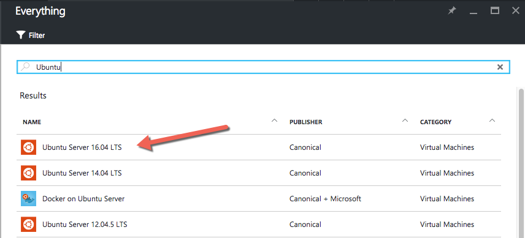

2. Select Ubuntu Server 16.04 LTS and select Create.
3. On the Basics blade of the Virtual Machine setup, set the following:

    * Name: Provide a unique name, such as “fabmedical-SUFFIX” as shown in the following screenshot.
    * VM disk type: Leave as SSD.
    * User name: Provide a user name, such as “adminfabmedical”.
    * Authentication type: Leave as SSH public key.
    * SSH public key: From your local machine, copy the public key portion of the SSH key pair you created previously, to the clipboard.

        * From WSL, verify you are in your user directory shown as “~”. This command will take you there:

            `cd ~`

        * Type the following command at the prompt to display the public key that you generated.

            `cat .ssh/fabmedical.pub`

        * Copy the entire contents of the file to the clipboard.

            

        * Paste this value in the SSH public key textbox of the blade.

    * Subscription: Choose the same subscription you are using for all your work.
    * Resource group: Choose Use existing and select the resource group you created previously.
    * Location: Choose the same region that you did before.
    * Select OK to complete the Basics blade.

        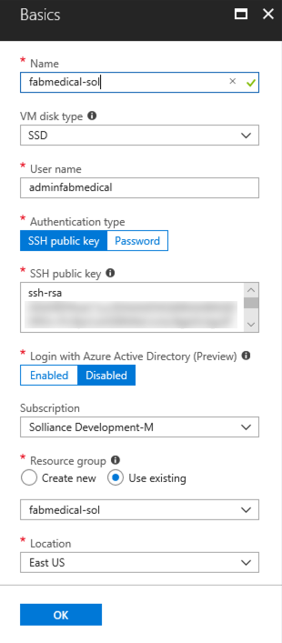

4. From the Size blade, choose D2S_V3 Standard and Select.

    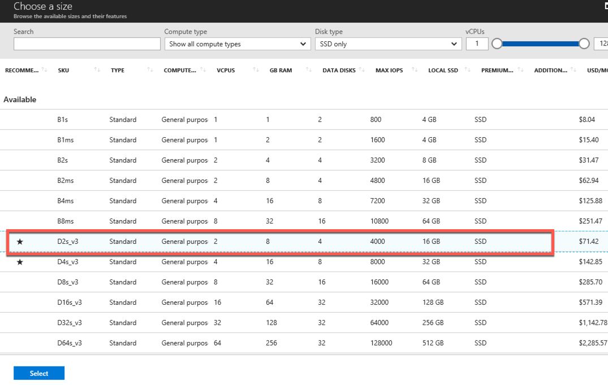

5. From the Settings blade, accept the default values for all settings and select OK.
6. From the Create blade, you should see that validation passed and select Create.

    

7. The VM will begin deployment to your Azure subscription.

    

8. Once provisioned, you will see the VM in your list of resources belonging to the resource group you created previously.

    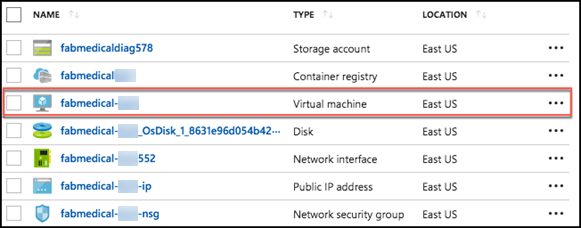

### Task 6: Connect securely to the build agent

In this section, you will validate that you can connect to the new build agent VM.

1. From the Azure portal, navigate to the Resource Group you created previously and select the new VM, fabmedical-SUFFIX.
2. In the Overview area for the VM, take note of the public IP address for the VM.

    

3. From your local machine, return to your open WSL window and make sure you are in your user directory ~ where the key pair was previously created. This command will take you there:

    `cd ~`

4. Connect to the new VM you created by typing the following command.

    `ssh -i [PRIVATEKEYNAME] [BUILDAGENTUSERNAME]@[BUILDAGENTIP]`

    Replace the bracketed values in the command as follows:

        • [PRIVATEKEYNAME]: Use the private key name “.ssh/fabmedical,” created above.

        • [BUILDAGENTUSERNAME]: Use the username for the VM, such as adminfabmedical.

        • [BUILDAGENTIP]: The IP address for the build agent VM, retrieved from the VM Overview blade in the Azure Portal.

    `ssh -i .ssh/fabmedical adminfabmedical@52.174.141.11`

5. When asked to confirm if you want to connect, as the authenticity of the connection cannot be validated, type “yes”.
6. When asked for the passphrase for the private key you created previously, enter this value.
7. You will connect to the VM with a command prompt such as the following. Keep this command prompt open for the next step.

    `adminfabmedical@fabmedical-SUFFIX:~$`
    

> NOTE: If you have issues connecting, you may have pasted the SSH public key incorrectly. Unfortunately, if this is the case, you will have to recreate the VM and try again.

### Task 7: Complete the build agent setup

In this task, you will update the packages and install Docker engine.

1. Go to the WSL window that has the SSH connection open to the build agent VM.
2. Update the Ubuntu packages and install curl and support for repositories over HTTPS in a single step by typing the following in a single line command. When asked if you would like to proceed, respond by typing “y” and pressing enter.

    `sudo apt-get update && sudo apt install apt-transport-https ca-certificates curl software-properties-common`

3. Add Docker’s official GPG key by typing the following in a single line command.

    `curl -fsSL https://download.docker.com/linux/ubuntu/gpg | sudo apt-key add -`

4. Add Docker’s stable repository to Ubuntu packages list by typing the following in a single line command.

    `sudo add-apt-repository "deb [arch=amd64] https://download.docker.com/linux/ubuntu $(lsb_release -cs) stable"`

5. Update the Ubuntu packages and install Docker engine, node.js and the node package manager in a single step by typing the following in a single line command. When asked if you would like to proceed, respond by typing “y” and pressing enter.

    `sudo apt-get update && sudo apt install docker-ce nodejs npm`

6. Now, upgrade the Ubuntu packages to the latest version by typing the following in a single line command. When asked if you would like to proceed, respond by typing “y” and pressing enter.

    `sudo apt-get upgrade`

7. When the command has completed, check the Docker version installed by executing this command. The output may look something like that shown in the following screen shot. Note that the server version is not shown yet, because you didn’t run the command with elevated privileges (to be addressed shortly).

    `docker version`
    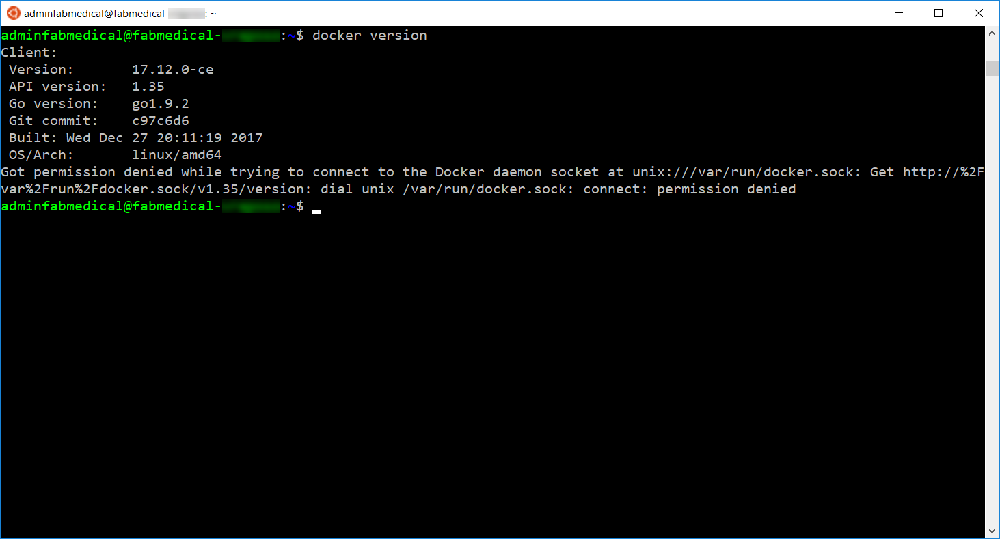

8. You may check the versions of node.js and npm as well, just for information purposes, using these commands.

    `nodejs --version`

    `npm -version`

9. Add your user to the Docker group so that you do not have to elevate privileges with sudo for every command. You can ignore any errors you see in the output.

    `sudo usermod -aG docker $USER`
    

10. In order for the user permission changes to take effect, exit the SSH session by typing ‘exit’, then press \<Enter>. Repeat the commands in Task 6: Connect securely to the build agent from step 4 to establish the SSH session again.
11. Run the Docker version command again, and note the output now shows the server version as well.

    

12. Run a few Docker commands.

    * One to see if there are any containers presently running

        `docker container ls`

    * One to see if any containers exist whether running or not

        `docker container ls -a`

13. In both cases, you will have an empty list but no errors running the command. Your build agent is ready with Docker engine running properly.

    

### Task 8: Create an Azure Container Registry

You deploy Docker images from a registry. To complete the lab, you will need access to a registry that is accessible to the Azure Container Service cluster you are creating. In this task, you will create an Azure Container Registry (ACR) for this purpose, where you push images for deployment.

1. In the [Azure Portal](https://portal.azure.com), select + Create a resource, Containers, then click Azure Container Registry.

    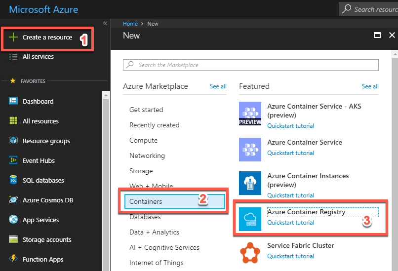

2. On the Create container registry blade, enter the following:

    * Registry name: Enter a name, such as "fabmedicalSUFFIX," as shown in the following screenshot.
    * Subscription: Choose the same subscription you are using for all your work.
    * Resource group: Choose Use existing and select the resource group you created previously.
    * Location: Choose the same region that you did before.
    * Admin user: Select Enable.
    * SKU: Select Standard.

        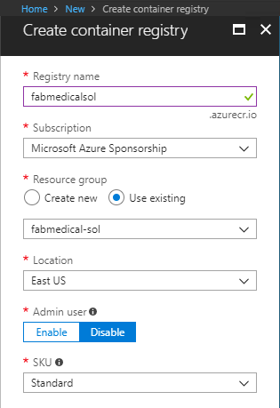

3. Select Create.
4. Navigate to your ACR account in the Azure Portal. As this is a new account, you will not see any repositories yet. You will create these during the lab.

    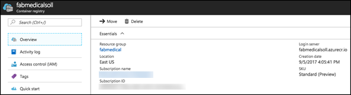

### Task 9: Create a Service Principal

Azure Container Service requires an Azure Active Directory service principal to interact with Azure APIs. The service principal is needed to dynamically manage resources such as user-defined routes and the Layer 4 Azure Load Balancer. The easiest way to set up the service principal is using the Azure cloud shell.

> NOTE: By default, creating a service principal in Azure AD requires account owner permission. You may have trouble creating a service principal if you are not the account owner.

1. Open cloud shell by selecting the cloud shell icon in the menu bar.

    

2. The cloud shell will open in the browser window.  Choose “Bash (Linux)” if prompted or use the left-hand dropdown on the shell menu bar to choose “Bash” (as shown).

    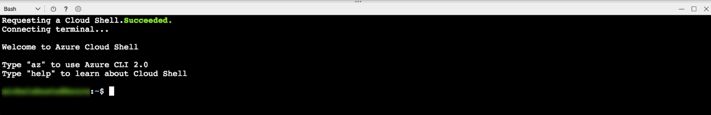

3. Before completing the steps to create the service principal, you should make sure to set your default subscription correctly. To view your current subscription type:

    `az account show`
    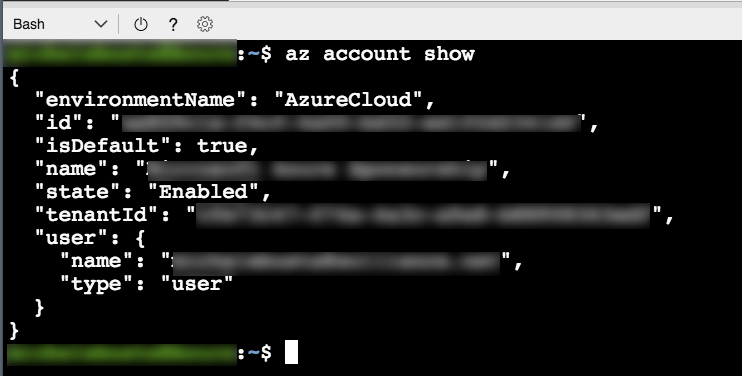

4. To list all of your subscriptions, type:

    `az account list`
    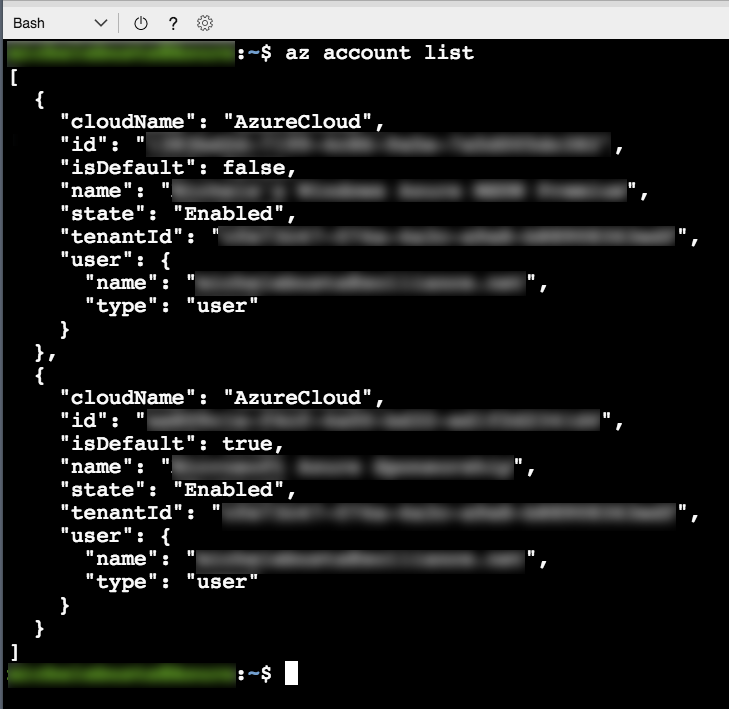

5. To set your default subscription to something other than the current selection, type the following, replacing {id} with the desired subscription id value:

    `az account set --subscription {id}`

6. To create a service principal, type the following command, replacing {id} with your subscription identifier, and replacing suffix with your chosen suffix to make the name unique.

    `az ad sp create-for-rbac --role="Contributor" --scopes="/subscriptions/{id}" --name="Fabmedical-sp-{SUFFIX}"`

7. The service principal command will produce output like this. Copy this information; you will need it later.

    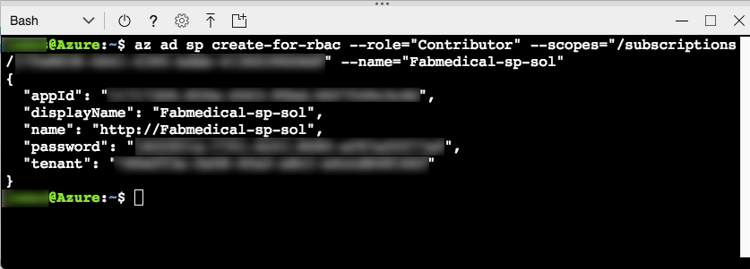

### Task 10: Create an Azure Container Service (AKS) cluster

In this task, you will create your Azure Container Service (AKS) cluster. You will use the same SSH key you created previously to connect to this cluster in the next task.

> NOTE: In this step, you will be asked to create a second Resource Group as part of the template for creating the Azure Container Service cluster. This is due to the current template not providing the option to select an existing Resource Group, and this may change in the future.

1. From the Azure Portal, select + Create a resource, Containers and select Azure Container Service - AKS.

    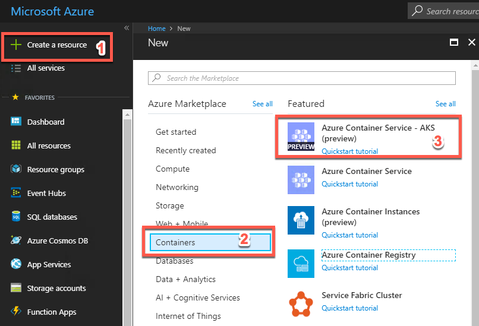

2. In the Basics blade provide the information shown in the screenshot that follows:

    * Name: Enter fabmedical-SUFFIX.
    * DNS Prefix: Enter fabmedical-SUFFIX.
    * Kubernetes version: keep default.
    * Subscription: Choose your subscription which you have been using throughout the lab.
    * Resource group: Create new and provide a unique name. Since the template does not support using an existing Resource Group, provide a new name such adding a “2” to the suffix, such as fabmedical-SUFFIX-2.
    * Location: Choose a location.

        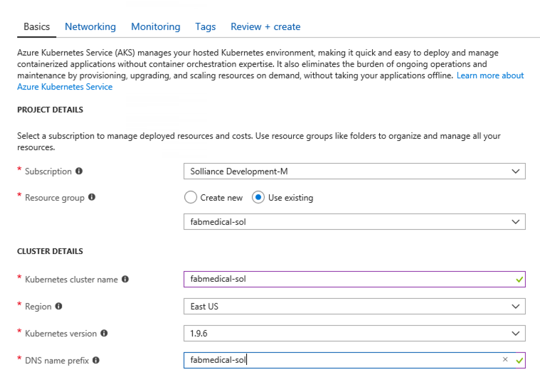

3. Select OK.
4. On the Configuration blade provide:

    * User name: Enter adminfabmedical
    * SSH Public Key: Paste the same SSH public key (fabmedical.pub) you used for the agent VM previously.
    * Service principal client ID: Use the service principal “appId” from the previous step.
    * Service principal client secret: Use the service principal “password” from the previous step.
    * Node count: 2
    * Node virtual machine size: Standard DS2_V2
    * OS Disk Size: leave empty

        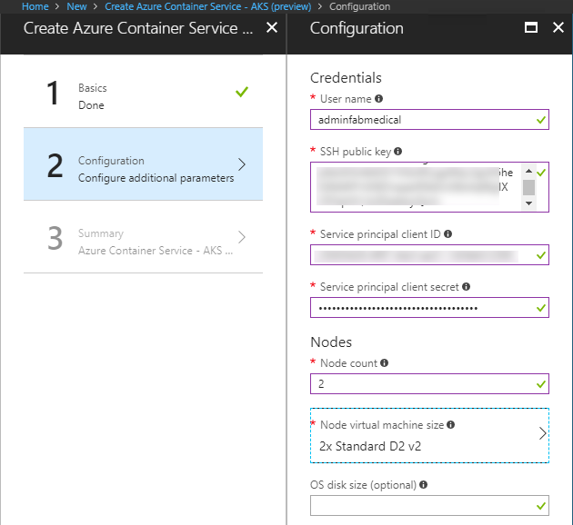

5. Select OK.
6. On the Summary blade, you should see that validation passed; select OK.

    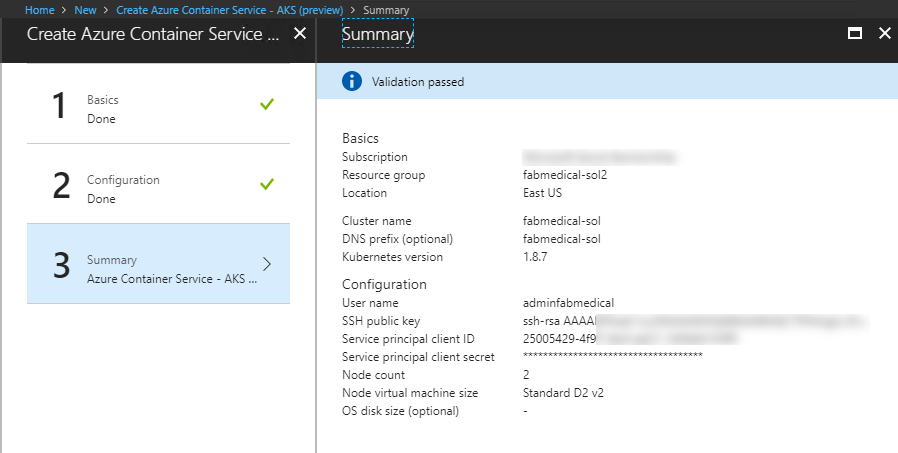

7. The Azure Container Service cluster will begin deployment to your Azure subscription.

    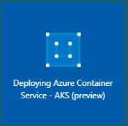

8. You should see a successful deployment notification when the cluster is ready. It can take up to 10 minutes before your Azure Container Service cluster is listed in the Azure Portal. You can proceed to the next step while waiting for this to complete, then return to view the success of the deployment.

    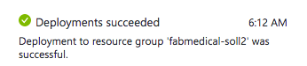

> NOTE: If you experience errors related to lack of available cores, you may have to delete some other compute resources or request additional cores to your subscription and then try this again.

### Task 11: Install Azure CLI

In later exercises, you will need the Azure CLI 2.0 to connect to your Kubernetes cluster and run commands from your local machine. A complete list of instructions for supported platforms is available on this page:

[https://docs.microsoft.com/en-us/cli/azure/install-azure-cli?view=azure-cli-latest](https://docs.microsoft.com/en-us/cli/azure/install-azure-cli?view=azure-cli-latest)

1. For MacOS – use homebrew

    `brew update`

    `brew install azure-cli`

2. For Windows – using WSL

    `echo "deb [arch=amd64] https://packages.microsoft.com/repos/azure-cli/ wheezy main" | sudo tee /etc/apt/sources.list.d/azure-cli.list`

    `sudo apt-key adv --keyserver packages.microsoft.com --recv-keys 52E16F86FEE04B979B07E28DB02C46DF417A0893`

    `sudo apt-get install apt-transport-https`

    `sudo apt-get update && sudo apt-get install azure-cli`

### Task 12: Install Kubernetes CLI

In later exercises, you will need the Kubernetes CLI (kubectl) to deploy to your Kubernetes cluster and run commands from your local machine.

1. Regardless of the operating system, considering the usage of WSL on Windows, install the Kubernetes client using Azure CLI

    `az login`

    `sudo az acs kubernetes install-cli --install-location /usr/local/bin/kubectl`