# Azure Container Service with DC / OS Lab Setup
This document describes all of the preparation you should take care of prior to the workshop.
If you do not have time, you may work on this during the workshop but may not complete as many lab steps
during lab times and can work on your own time to complete the lab at your leisure.

# Prerequisites

The lab will make use of several tools and services.  Here is a list of requirements that you will need to successfully complete the lab.  If you are missing any of these requirements, we will cover the steps to satisfy them in this document.

* An internet connection.
* Azure Account.
    * You will need a Microsoft Account
	* You will need to enter credit card information
* A DockerHub account
	* You will need an email address
* A browser, preferably Chrome for consistency with this guide.
* A command prompt (some commands will work in windows CMD but for consistency we will use bash by default).
	* You will need openssh at a minimum
    
# Preparation Steps in this Document

**Create your Azure Account**

**Create a cluster and supporting tooling / setup**
* Task 1: Create a new Resource Group 
* Task 2: Install Git tools
* Task 3: Create an SSH key
* Task 4: Create a build agent VM 
* Task 5: Connect securely to the build agent
* Task 6: Complete the build agent setup
* Task 7: Create a Docker Hub account
* Task 8: Create an Azure Container Service cluster

	
#Create Azure Account 

1. Microsoft Azure subscription must be pay-as-you-go or MSDN. ***(Trial subscriptions will not work)***.

2. First login with your live account then go to this link [https://azure.microsoft.com/en-us/pricing/purchase-options](https://azure.microsoft.com/en-us/pricing/purchase-options) 

    

3. Then you will be directed to Azure sign up page where you have to provide your details

    

4. Once you fill your details and push purchase you will be directed to this page

    

5. Click on Get Started With your Azure subscription.

6. You are redirected to Azure portal

    

# Before the Workshop Setup 
**Duration:** 30 minutes ***(possibly additional time if Azure provisioning is slower)***

You should follow all of the steps provided in Exercise 0 before attending the lab. 

## Task 1: Create a new Resource Group 
You will create an Azure Resource Group to hold most of the resources that you create in this lab. 
This approach will make it easier to clean up later. You will be instructed to create new resources in this Resource Group during the remaining exercises. 

1.	In your browser, navigate to the Azure Portal ([https://portal.azure.com](https://portal.azure.com)).

2.	Click +New in the navigation bar at the left.

    
    
3.	Create a new Resource Group. Name it something like “*fabmedical*-SUFFIX” as shown in the following screen shot.

4.	Select the subscription you will use for all the steps during the lab.

5.	Choose a region and remember this for future steps so that the resources you create in Azure are all kept within the same region.

    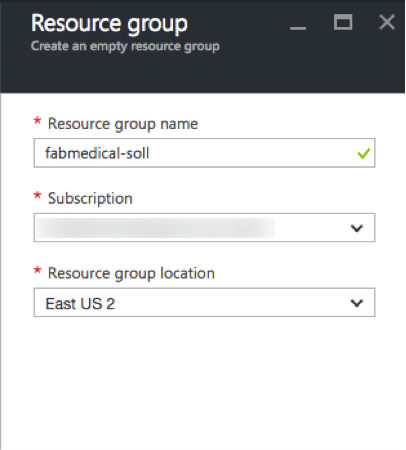
  
6. Your Resource Group is listed in the Azure Portal.  
  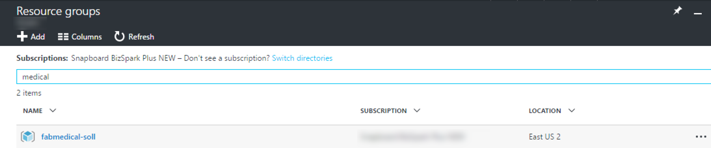

##Task 2: Install Git tools

In this section, you will install Git tools. 
This documentation assumes you are installing Git tools for Windows but you may use another platform to achieve the same results at your own discretion.

1.  Navigate to <https://git-scm.com/download> and select Windows. This will download the latest Git tools executable.

    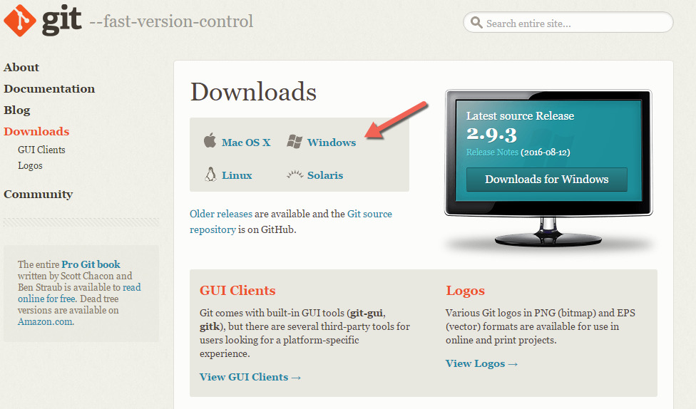
    
2. Run the executable, click Next to pass the license dialog, and accept the default Git folder path.

3. On each dialog, choose the settings as shown in the following screen shots, and click Next until reaching the final screen where you will click Install.

    

    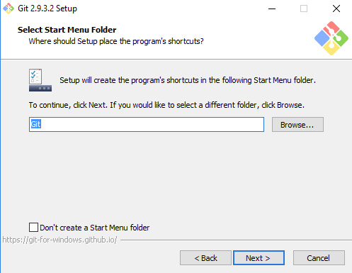

    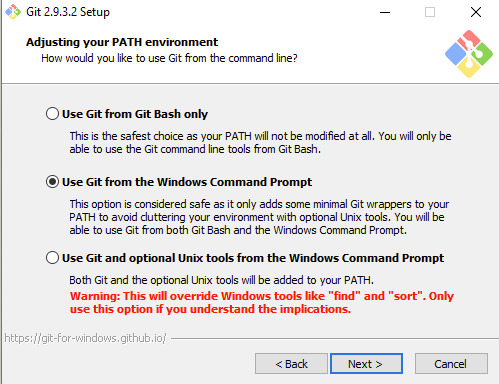

    

    

    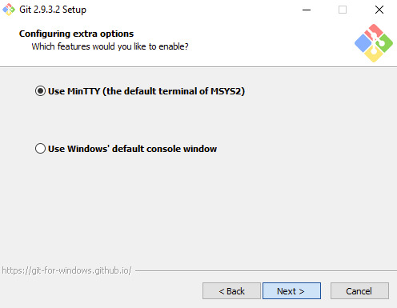

    

    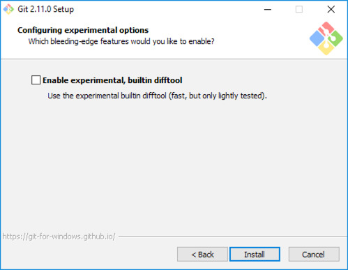

4.  When the installation is completed, check Launch Git Bash and click Finish to show the command line window.

    

5. At the end of these steps you should see the Git Bash command line window.

    
    
##Task 3: Create an SSH key

In this section, you will create an SSH key to securely access the VMs you create during the upcoming exercises.

1.  Open Git Bash to access the command line tool.

    
    
2.  From the command line enter the following command to generate an SSH key pair. You must use “ubuntu” as the comment data.

    `$ ssh-keygen -t RSA -b 2048 -C ubuntu`

    * When prompted enter “fabmedical\_rsa” as the key file name.
    *  Enter a passphrase when prompted, and don’t forget it!

3.  The file will be generated in your user folder where Git Bash opens by default, so be sure to take note of the path.

    
    
4. Navigate to your user folder at c:\\Users\\\[your username\]. You will see the file matching the name you provided.

    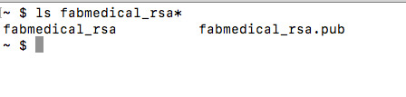

## Task 4: Create a build agent VM ##
In this section you will create a Linux VM to act as your build agent. 
You will be installing Docker to this VM once it is set up and you will use this VM during the lab to develop and deploy.
 
**NOTE: You can set up your local machine with Docker however the setup varies for different versions of Windows. For the purpose of this lab the build agent approach simply allows for predictable setup.**

1.	From the Azure Portal, select New -> MARKETPLACE See All and type “Ubuntu” in the filter.

    
 
2.	Select Ubuntu Server 16.04 LTS.
3.	From the Ubuntu Server 16.04 LTS blade, select Resource Manager deployment model and click Create.

    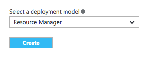
 
4.	From the Basics blade of the Virtual Machine setup, provide a unique name such as “fabmedical-SUFFIX” as shown in the following screenshot.

    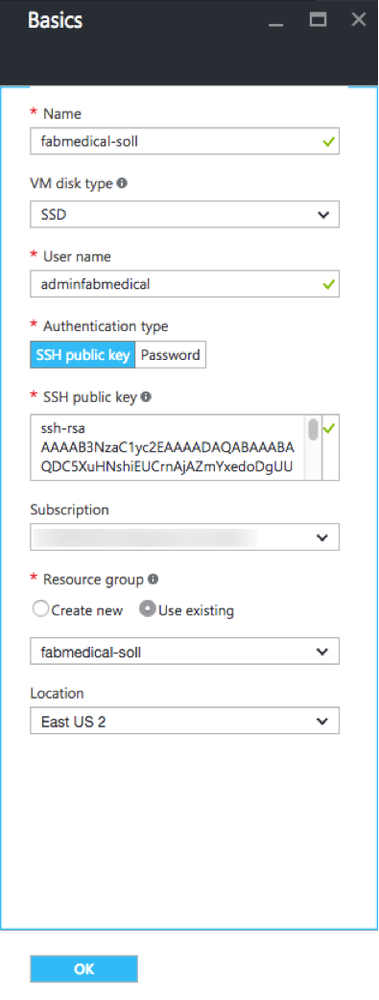
 
5.	Leave the VM disk type as SDD. 

6.	Provide a VM username such as “adminfabmedical”.

7.	Leave the Authentication type as SSH.

8.	From your local machine, copy the public key portion of the SSH key pair you created previously, to the clipboard.
	* From Git Bash, verify you are in your user directory c:\Users\[your username].
	* Open the public key that you generated, in notepad.
	
        `notepad fabmedical.pub`

        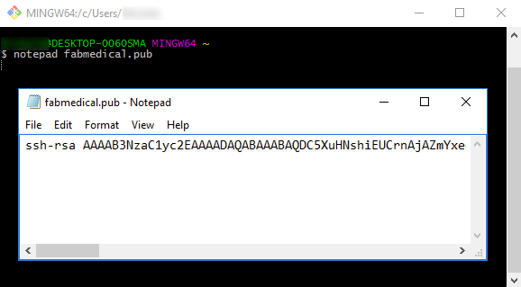
    
	* Copy the entire contents of the file to the clipboard. Take care not to introduce any line breaks or spaces at the beginning or end of the text.
	
	* Paste this value in the SSH public key textbox of the blade. 

9.	Choose the same subscription you are using for all your work.

10.	Choose the same resource group as you created previously.

11.	Choose the same region that you did before.

12.	Click OK to complete the Basics blade.

13.	From the Size blade choose DS1_V2 Standard.

    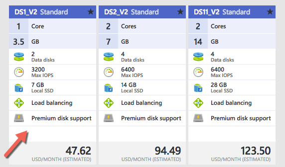
 
14.	From the Settings blade, accept the default values for all settings and click OK.

    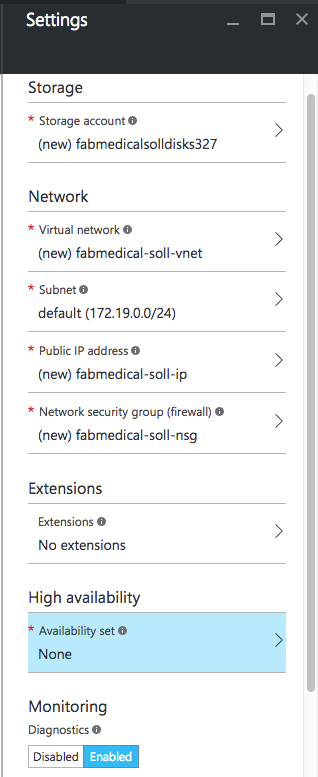
 
15.	From the Summary blade, you should see that validation passed and click OK.

    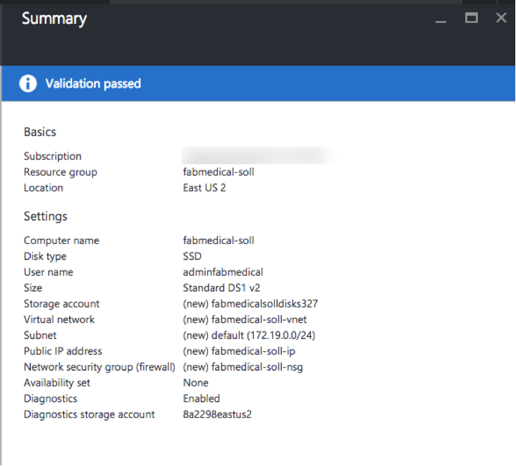
 
16.	The VM will begin deployment to your Azure subscription.

    
 
17. When the VM is provisioned you will see it in your list of resources belonging to the resource group you created previously.

    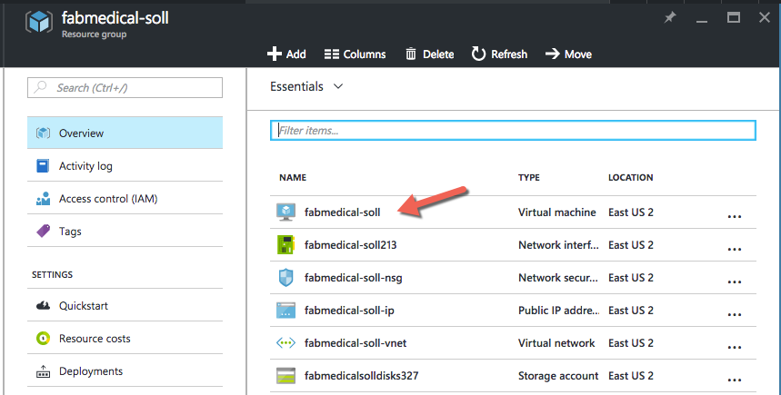
 

## Task 5: Connect securely to the build agent ##
In this section you will validate that you can connect to the new build agent VM.

1.	From the Azure portal, navigate to the Resource Group you created previously and select the new VM, fabmedical-SUFFIX. 

2.	In the Essentials area for the VM, take note of the public IP address for the VM.

    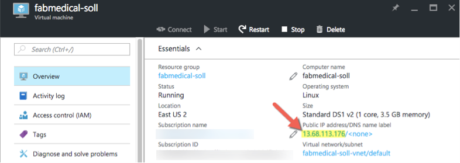
 
3.	From your local machine, launch Git Bash and navigate to your user directory c:\Users\[your username] where the key pair was previously created.

4.	Connect to the new VM you created by typing the following command. 
	
	`ssh -i [PRIVATEKEYNAME] [BUILDAGENTUSERNAME]@[BUILDAGENTIP]`
	
	Use the private key name such as “fabmedical”, the username for the VM such as adminfabmedical, and the IP address for the build agent VM. 
	
	`ssh -i fabmedical adminfabmedical@13.68.113.176`

5.	You will be asked to confirm if you want to connect, as the authenticity of the connection cannot be validated. Type “yes”.

6.	You will be asked for the pass phrase for the private key you created previously. Enter this value. 

7. You will now be connected to the VM with a command prompt such as the following. Keep this command prompt open for the next step. 

    `adminfabmedical@fabmedical-soll:~$`

    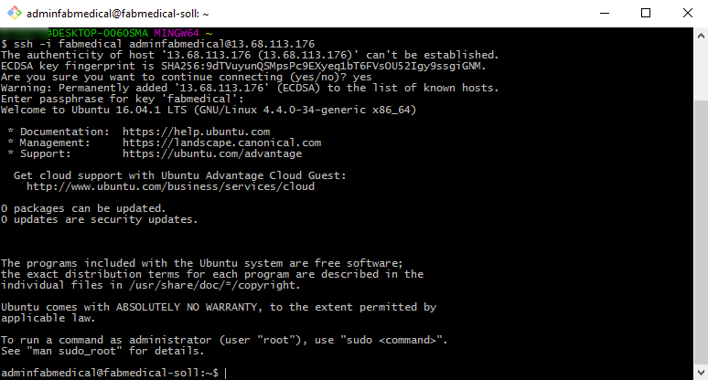

    **NOTE: If you have issues connecting, you may have pasted the SSH public key incorrectly. Unfortunately if this is the case, you will have to recreate the VM and try again.**

## Task 6: Complete the build agent setup ##
In this task you will update the packages and install Docker engine. 

1.	Go to Git Bash, with the connection open to the build agent VM.

2.	Update the Ubuntu packages and install Docker engine, curl, node.js and the node package manager in a single step by typing the following in a single line command.

    `sudo apt-get update && sudo apt-get –y install docker.io curl nodejs npm`

3.	When the command has completed, check the Docker version installed by executing this command. The output may look something like that shown in the following screen shot. Note that the server version is not shown yet, because you didn’t run the command with elevated privileges (to be addressed shortly).

     `docker version`

    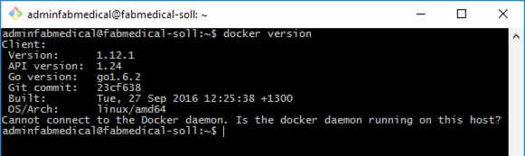

4.	You may check the versions of node.js and npm as well, just for information purposes, using these commands.

    `nodejs --version`

    `npm -version` 

5.	Add your user to the Docker group so that you do not have to elevate privileges with sudo for every command. You can ignore any errors you see in the output. 

    `sudo usermod -aG docker $USER`
    
    NOTE: You may see the following error messages when running the sudo command.  They can be ignored.

    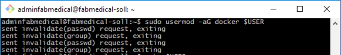

6.	In order for the user permission changes to take effect, exit the SSH session by typing ‘exit’, then press <Enter>. Repeat the commands in Task 5 from step 4 to establish the SSH session again. 

7.	Now, run the Docker version command again, and note the output now shows the server version as well.

    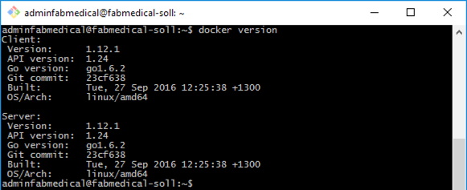
 
8. Run a few Docker commands. 
* One to see if there are any containers presently running
* One to see if any containers exist whether running or not
* In both cases, you will have an empty list but no errors running the command. Your build agent is ready with Docker engine running properly.

    `docker ps`

    `docker ps -a`

    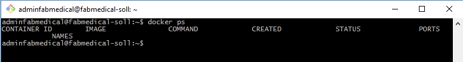

## Task 7: Create a Docker Hub account ##
Docker images are deployed from a Docker Registry. 
To complete the lab, you will need access to a registry that is publicly accessible to the Google Cloud cluster you are creating. 
In this task, you will create a free Docker Hub account for this purpose, where you push images for deployment.

**NOTE: If you already have a public Docker Hub account you do not need to complete this task – you will need the name of the account for the exercises that rely on it.**

1.  Navigate to Docker Hub at <https://hub.docker.com>.

2.  Create a new Docker Hub account by providing a unique name for your Docker Hub ID, your email address for confirmation of the account, and a password.

    
    
3.  Once you confirm your email address, you can sign in and confirm your Docker Hub account is ready.

    

4. Login to your Docker Hub account. If it is a new account, you will not see any repositories yet. You will create these during the lab.

    

## Task 8: Create an Azure Container Service cluster ##

In this task you will create your Azure Container Service cluster based on Apache Mesos. You will use the same SSH key you created previously to connect to this cluster in the next task.

**NOTE: In this step, you will be asked to create a second Resource Group as part of the template for creating the Azure Container Service cluster. This is due to the current template not providing the option to select an existing Resource Group, and this may change in the future.**

1.	From the Azure Portal, select New -> Containers and select Azure Container Service. 

    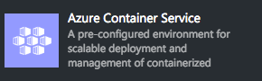

2.	From the Azure Container Service blade click Create.

3.	In the Basics blade provide the information shown in the screen shot that follows:

	* Enter a username such as “adminfabmedical”.

	* Paste the same SSH public key you used for the agent VM previously.

	* Choose the same subscription and location as you are using for other resources.

	* Since the template does not support using an existing Resource Group, provide a new name such adding a “2” to the suffix, such as fabmedical-SUFFIX2.

        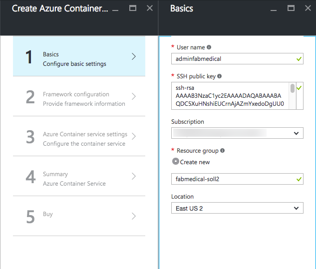

4.	From the Framework configuration blade, choose DC/OS for the Orchestrator configuration, then click OK.

    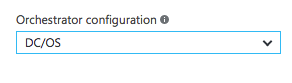

5.	From the Azure Container service settings blade, enter the settings shown in the screen shot that follows:
	
	* Set the Agent count to 2.
	
	* Choose Standard DS1 for the Agent virtual machine size.
	
	* Set the Master count to 1.
	
	* Set the DNS prefix to something like “fabmedical-SUFFIX”.
	
	* Click OK.

        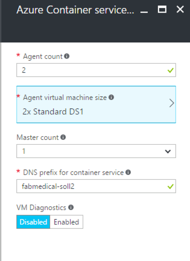

6.	Review the Summary blade and click OK.
    
    

7.	From the Purchase blade, click Purchase.

8. You should see a successful deployment notification when the cluster is ready. It can take up to 30 minutes or more before your Azure Container Service cluster is listed in the Azure Portal. 

    

    **Note: If you experience errors related to lack of available cores, you may have to delete some other compute resources or request additional cores be added to your subscription and then try this again.**