# Azure Service Fabric Lab Setup
This document describes all of the preparation you should take care of prior to the workshop.
If you do not have time, you may work on this during the workshop but may not complete as many lab steps
during lab times and can work on your own time to complete the lab at your leisure.

# Prerequisites

The lab will make use of several tools and services.  Here is a list of requirements that you will need to successfully complete the lab.  If you are missing any of these requirements, we will cover the steps to satisfy them in this document.

-   Microsoft Azure subscription must be pay-as-you-go or MSDN.

    -   Trial subscriptions will *not* work.

-   Local machine or a virtual machine configured with:

    -   Visual Studio 2015 with Update 3 or later

    -   Azure SDK 2.9.1 or later for Visual Studio 2015

    -   Service Fabric SDK 2.4.145 (with Runtime 5.4.145) for use with
        Visual Studio 2015

    -   Azure PowerShell 1.0.0 or later

    -   A browser such as Edge, Chrome, or Firefox (IE does not work
        with Swagger commands)

# Preparation Steps in this Document

**Create your Azure Account**

**Create a cluster and supporting tooling / setup**
* Task 1: Create a new Resource Group 
* Task 2: Create a Service Fabric Cluster
* Task 3: Validate Service Fabric ports
	
#Create an Azure Account 

1. Microsoft Azure subscription must be pay-as-you-go or MSDN. ***(Trial subscriptions will not work)***.

2. First login with your live account then go to this link [https://azure.microsoft.com/en-us/pricing/purchase-options](https://azure.microsoft.com/en-us/pricing/purchase-options) 

    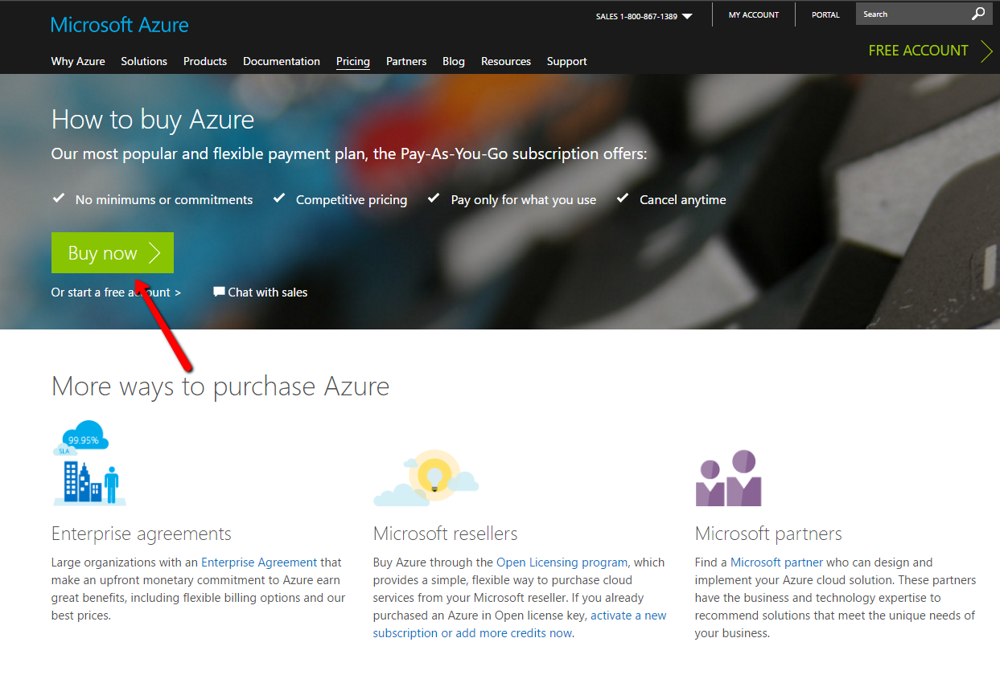

3. Then you will be directed to Azure sign up page where you have to provide your details

    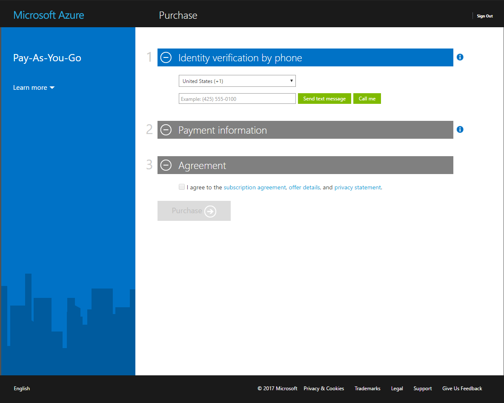

4. Once you fill your details and push purchase you will be directed to this page

    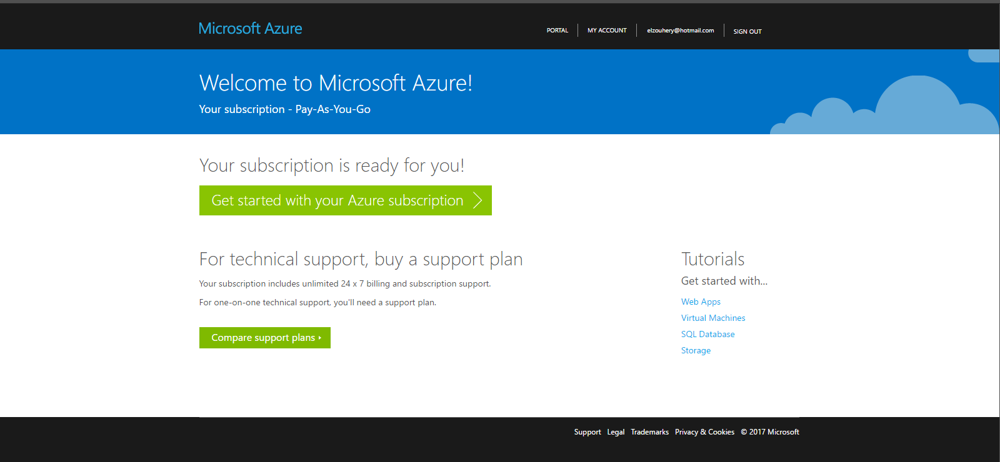

5. Click on Get Started With your Azure subscription.

6. You are redirected to Azure portal

    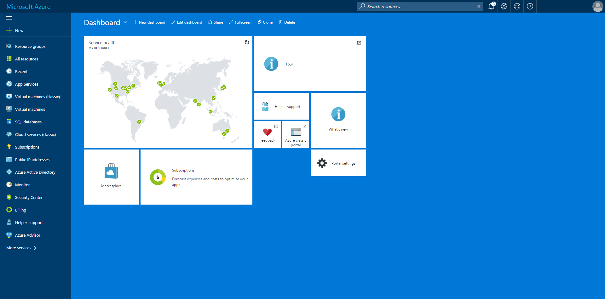

# Before the Workshop Setup 

**Duration:** 15 minutes (plus up to 30 minutes or more provisioning time)

## Task 1: Create a new Resource Group 
You will create an Azure Resource Group to hold most of the resources that you create in this lab. 
This approach will make it easier to clean up later. You will be instructed to create new resources in this Resource Group during the remaining exercises. 

1.	In your browser, navigate to the Azure Portal ([https://portal.azure.com](https://portal.azure.com)).

2.	Click +New in the navigation bar at the left.

    
    
3.  Create a new Resource Group. Name it something like
“contosoevents-SUFFIX” as shown in the following screen shot.

4.	Select the subscription you will use for all the steps during the lab.

5.	Choose a region and remember this for future steps so that the resources you create in Azure are all kept within the same region.

    

6. Your Resource Group is listed in the Azure Portal.  
  

## Task 2: Create a Service Fabric Cluster

In this section you will provision the Service Fabric Cluster.

1.  From the Azure Portal, select New -&gt; Compute -&gt; Service Fabric
Cluster

> 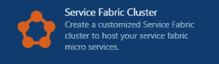

2.  From the Basics blade of the Create Service Fabric Cluster setup,
    provide a unique cluster name such as “contosoeventssf-SUFFIX” as
    shown in the following screen shot.

3.  Leave the Operating system set to Windows.

4.  Provide a username and password for the VM.

5.  Select the subscription.

6.  Select ‘Use existing’ resource group and choose the Resource Group
you previously created.

7.  Choose the same region that you did before.

8.  Click OK to complete the Basics blade.

    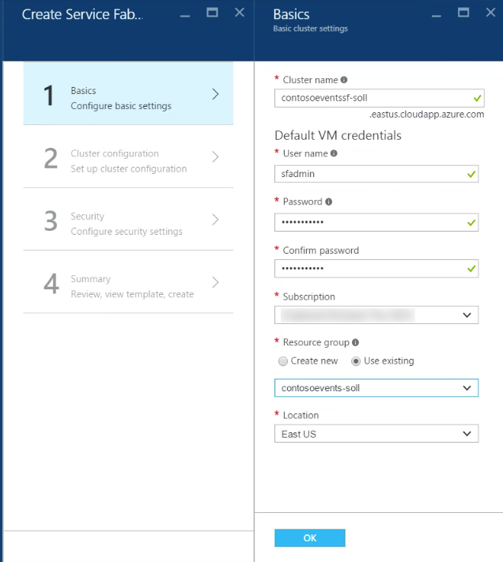

9.  From the Cluster Configuration blade, leave the default Node type
    count as shown in the following screen shot.

10.  Click Node type 1 to configure required settings and provide a Node
type name of Web.

11.  Leave the default value for Durability tier, Reliability tier, and
leave Initial VM scale set capacity at 5 nodes.

12.  For Custom endpoints enter: 8082. This will allow the Web API to be
accessible through the cluster.

    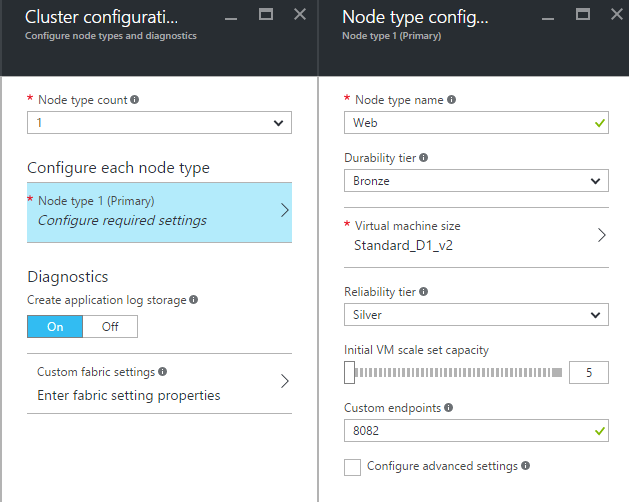

13.  Select VM size D1\_V2 standard as shown in the following screen shot
    before clicking OK on the Node type configuration blade.

 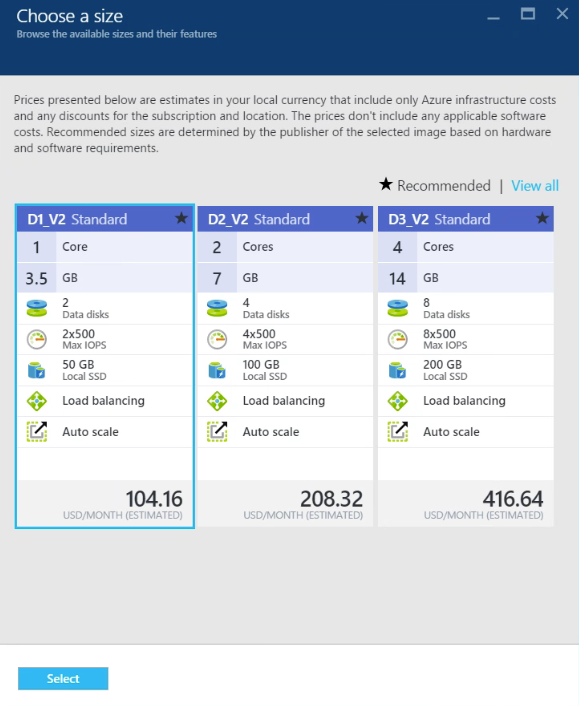

 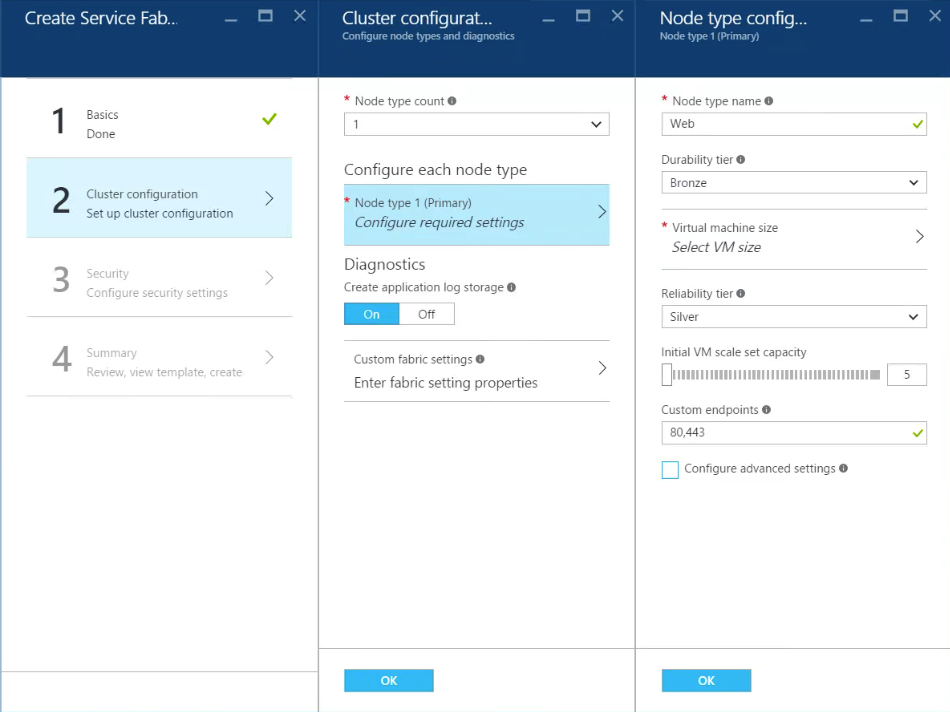

14.  Leave the Diagnostics on and click OK to complete Cluster
    configuration.

15.  From the Security blade you have an opportunity to provide security
settings for the cluster. This is a configuration made up front that
cannot be changed later. Without this setting in place, anyone can
reach the cluster. That said, in the interest of time during this
lab only you will set the cluster security mode to Unsecure as
shown in the following screen shot.

 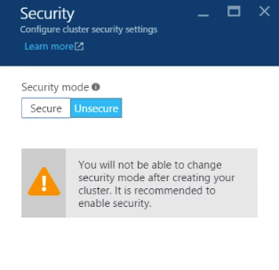

16.  Click OK to review a summary of this configuration.

17.  Review the summary and click Create to begin creating the new
cluster.

 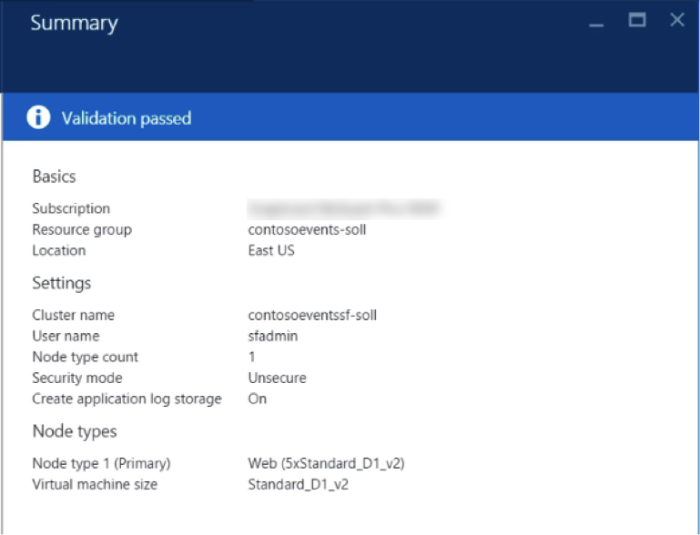
 
18.  It can take up to 30 minutes or more before your Service Fabric
Cluster is listed in the Azure Portal in the Resource Group that you
created earlier.

 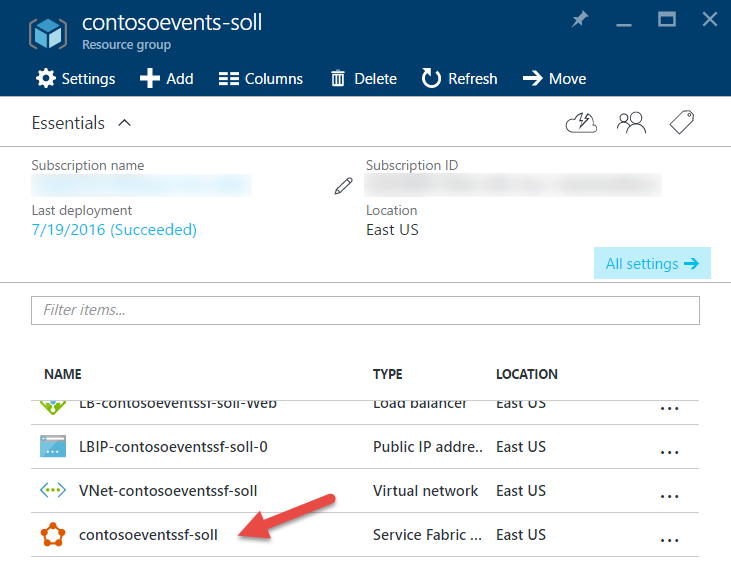

## Task 3: Validate Service Fabric ports

Occasionally, when you create a new Service Fabric Cluster using the
portal, the ports that you requested are not created. This will become
evident when you try to deploy and run the Web App, because the required
ports will not be accessible through the cluster.

In this task you will validate that the ports are open and if not, fix
the issue.

1.  Navigate to the Resource Group you created previously, and where you
created the cluster. If it is still deploying, do not proceed to the
next step until deploying is completed.

    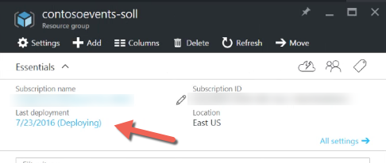

2.  Select the load balancer.

    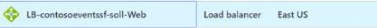

3.  From the Settings blade, select Health Probes.

4.  Verify if a probe exists for port 8082:

    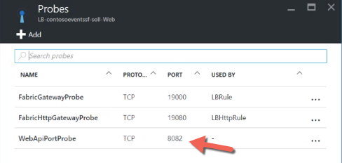

6.  If there is, select it and verify that it is “used by” a load
balancing rule. This should be indicated at the bottom of the probe
blade. If it is, you can skip this step – the probe and
load-balancing rule requested in the template will have been
correctly created. Otherwise, proceed to the next step to create the
probe and the load-balancing rule.

7.  Click Add from the Probes blade.

8.  Supply the name ‘WebApiPortProbe’ and select TCP protocol.

9.  Enter 8082 for the port.

    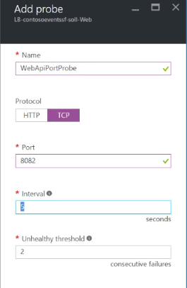

10. Click OK to create the probe.

    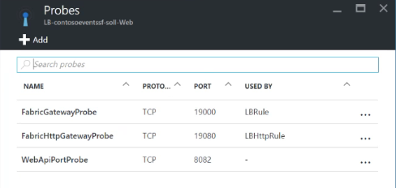

11. Create a rule associated with this probe. From the Settings blade
select Load balancing rules.

 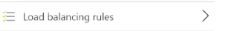

12.  Click Add.

13.  Set the name to ‘LBWebApiPortRule’.

14.  Leave protocol as TCP.

15.  Set the Port and Backend port to 8082.

16.  From the Health Probe list select your previously created
    WebApiPortProbe.

17.  Click OK.

18.  If you get an error notification such as “Failure to create probe”,
ignore this but just go check that the probe indeed exists. It
should.

 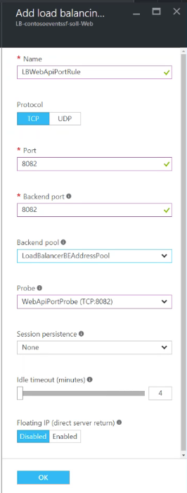

19. You will now have a cluster ready to deploy to and expose 8082
as the Web API endpoint / port.
