# Google Cloud Lab Setup
This document describes all of the preparation you should take care of prior to the workshop.
If you do not have time, you may work on this during the workshop but may not complete as many lab steps
during lab times and can work on your own time to complete the lab at your leisure.

+**WARNING: depending on the region you are in, Google may require you verify your credit card and identification before you can use the account, this does not always happend but I just discovered this while creating a new account...so do this early if you really want to use Google for the lab on Wed/Thurs this week!**

#Prerequisites
The lab will make use of several tools and services.  Here is a list of requirements that you will need to successfully complete the lab.  If you are missing any of these requirements, we will cover the steps to satisfy them in this document.

* An internet connection.
* Google Cloud Account.
	* You will need to enter credit card information
* A DockerHub account
	* You will need an email address
* A browser, preferably Chrome for consistency with this guide.
* A command prompt (come commands will work in windows CMD but for consistency we will use bash by default).
	* You will need openssh at a minimum
	* You will need the google cloud sdk 

#Preparation Steps in this Document

**Create your Google Cloud Account and Setup Kubectl (30-40 minutes) **
* Task 1: Create a Google Cloud Account 
* Task 2: Create the Lab Project 
* Task 3: Install Google Cloud SDK
* Task 4: Enable the Container Engine API 
* Task 5: Install Kubectl 

**Create a cluster and supporting tooling / setup (30 minutes)**
* Task 1: Install Git Tools
* Task 2: Create an SSH key
* Task 3: Create a build agent VM
* Task 4: Connect securely to the build agent
* Task 5: Complete the build agent setup
* Task 6: Create a Docker Hub account
* Task 7: Create a Google Container Engine cluster 

# Create a Google Account and setup KubeCtl

##Task 1: Create a Google Cloud Account
**Duration**: 10-15 minutes

1. Go to the account sign-up page: https://accounts.google.com/signup

   Provide the necessary information to create a Google account.

2. Next go to the Google Cloud home page: https://cloud.google.com/ Click “Console”

   

3. Choose whether to get emails, then accept the terms and conditions:

    

4. Choose “Try Google Cloud Platform for free”

   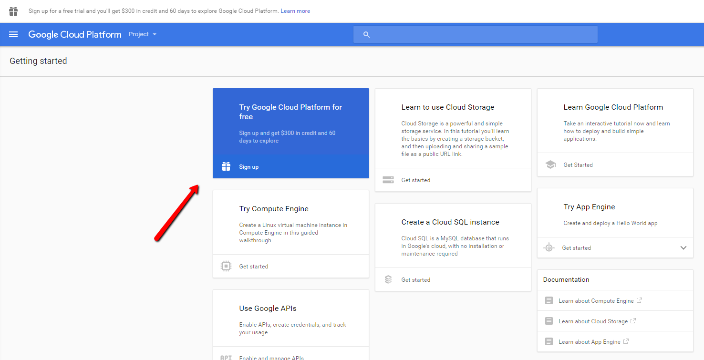  

5. Choose country and choose whether to get emails.  Accept the terms.

     

6. Provide name and address, phone number and credit card.  All items are required.

7. Your account is ready.
 
   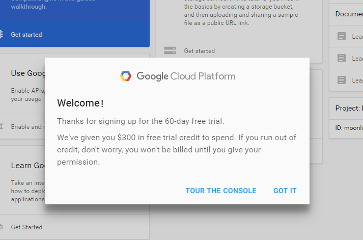  
   
##Task 2: Create the Lab Project
**Duration:** 5 minutes

Google creates an initial project for you
 
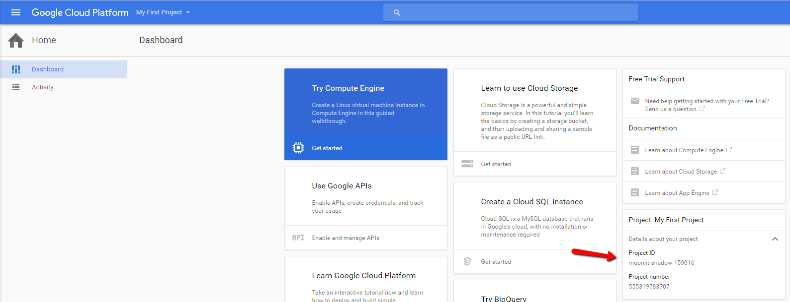

1. Create a new project with a more memorable name

    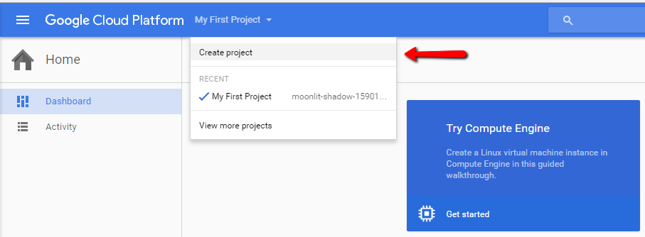
 
    Make the project name and id match if possible. This makes it easier to remember later.  Use the edit button if necessary.  Google will add a number if the name is already taken, so you can use a suffix like “microservices101-jstudent” (first initial followed by last name) to make sure that the name and project id match.  This is a nicer experience because generated URLs and other ids will use the project id, not the friendly name.  Creating project takes a few moments.  You can move on to install the SDK while it runs.
    
   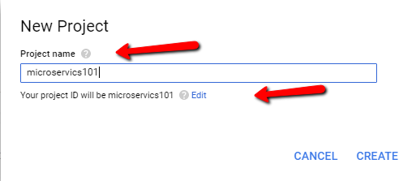 

2. You see your new project in the console.

    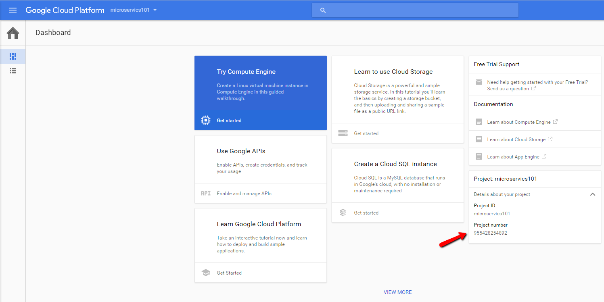 

## Task 3: Install Google Cloud SDK #
**Duration:** 5-10 minutes

Go to https://cloud.google.com/sdk/docs/
Follow the instructions for your platform. The next two sections describes mac then windows setup.

### Tasks to complete (Mac)

1. Open a terminal window.
2. Verify python is installed by printing its version.
    `$ python -V`
3. Download the SDK package.
    `$ curl https://dl.google.com/dl/cloudsdk/channels/rapid/downloads/google-cloud-sdk-141.0.0-darwin-x86_64.tar.gz -o google-cloud-sdk.tar.gz`
4. Unpack
    
    `$ tar xvzf google-cloud-sdk.tar.gz`
    
5. Run the install script.

    `$ ./google-cloud-sdk/install.sh`
    
6. Refresh your terminal settings.

    `$ source .bash_profile`
7. Initialize your gcloud configuration.

    `$ google-cloud-sdk/bin/gcloud init`
    
8. When prompted, choose to login.  This will open a browser where you can authenticate with google.

    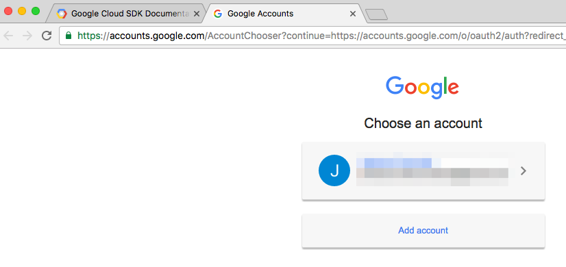
    
9. Choose your account, then allow access:

    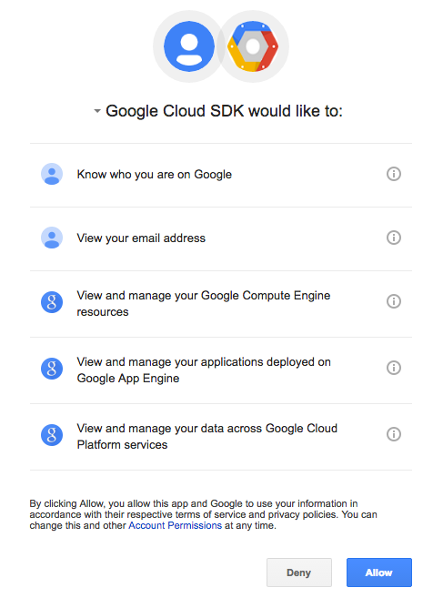 
    
10. Next return to the terminal and enter the number which corresponds to the project you created earlier.  

    If this is a new account, the number should be 1.
    
    You may also be prompted to configure Compute Engine settings.  
    
    If so, enter Y and then choose a compute zone near you by entering its number from the list. 
    
11. Verify login to your project.

    `$ gcloud auth login <your google account email address> --brief`
 
    If gcloud detects that you need to authorize, then you will be presented with the account chooser.  Choose your account. Allow access.  
    If you do not need to authorize, gcloud will not launch the browser.

12. Next login with the “application-default” credentials.  
    
    Choose your account.  Allow access.

    `$ gcloud auth application-default login`

13. Verify access by listing vm instances

    `$ gcloud compute instances list`

   If this is a new account and/or project then the command should succeed but there should be no instances.

### Tasks to complete (Windows)

1. Download the installer: 

    [https://dl.google.com/dl/cloudsdk/channels/rapid/GoogleCloudSDKInstaller.exe](https://dl.google.com/dl/cloudsdk/channels/rapid/GoogleCloudSDKInstaller.exe)

2. Start the installer wizard and step through:

   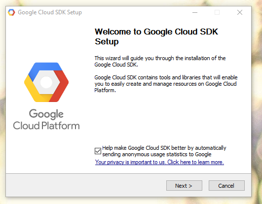

3. Accept terms:

   
 
4. Single User is fine:

   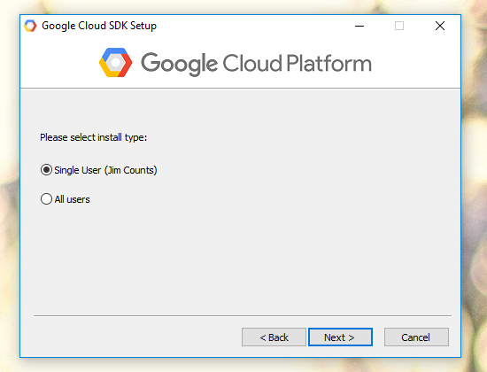

5. If you do not have Python, the installer can add it for you.  

    You will need Python for the tool to work:

    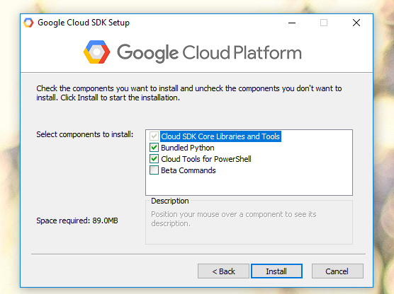

6.  Wait for installation to finish:

	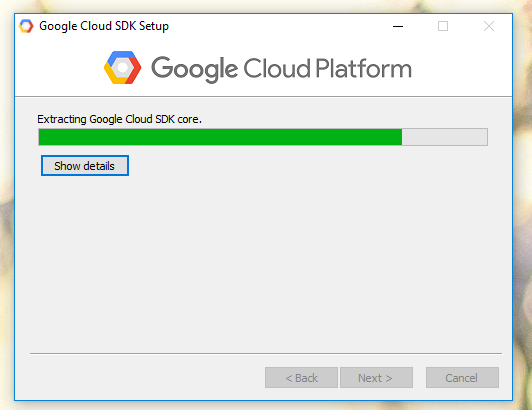
 
7. Installation looks like this when complete:
	
	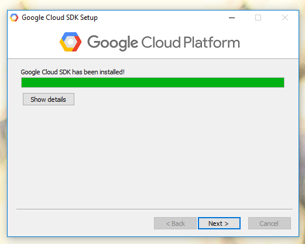

8. Make sure to leave the last two checkboxes checked so that we can complete the configuration:

    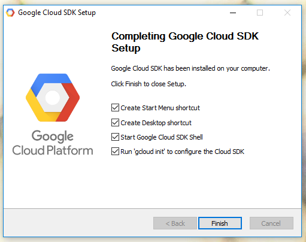

9. Next the shell will launch and run gcloud init:

    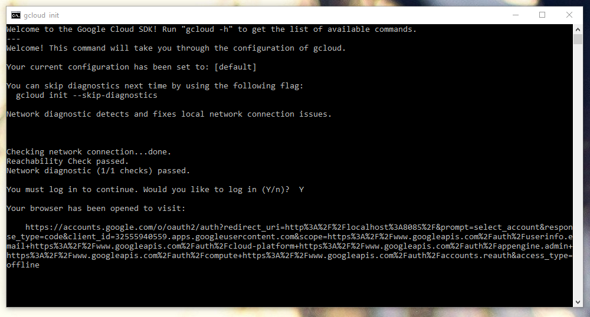
 
10. Sign in with your browser (if needed) and grant permission to the SDK

    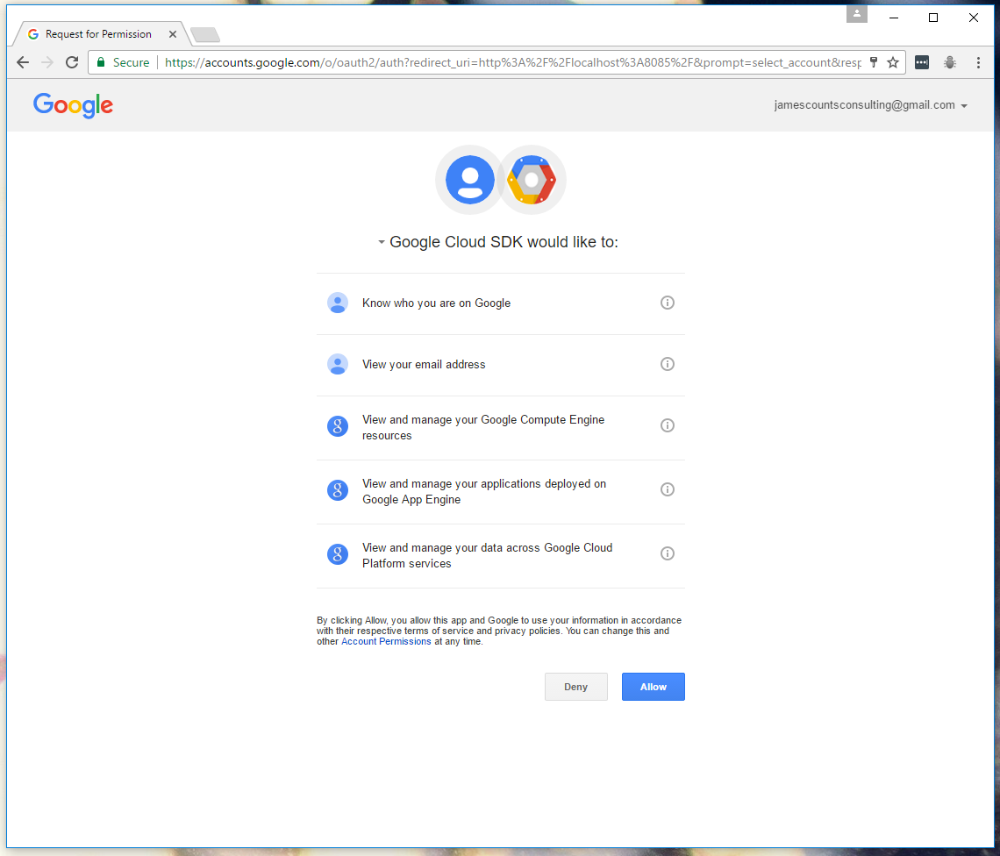
 
11. Return to the open console window

    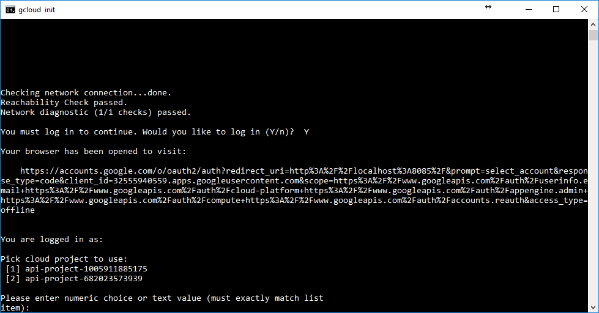

12. Select your project.

13. Verify login to your project.

    `$ gcloud auth login <your google account email address> --brief`

    If gcloud detects that you need to authorize, then you will be presented with the account chooser.  Choose your account. Allow access.  
    
    If you do not need to authorize, gcloud will not launch the browser.

14. Next login with the “application-default” credentials.  

    Choose your account.  Allow access.

    `$ gcloud auth application-default login`

15. Verify access by listing vm instances

    `$ gcloud compute instances list`

    If this is a new account and/or project then the command should succeed but there should be no instances.
   
##Task 4: Enable the Container Engine API #

**Duration:** 5 minutes

1. Go to the project home page.  Click “Enable APIs and get credentials”

    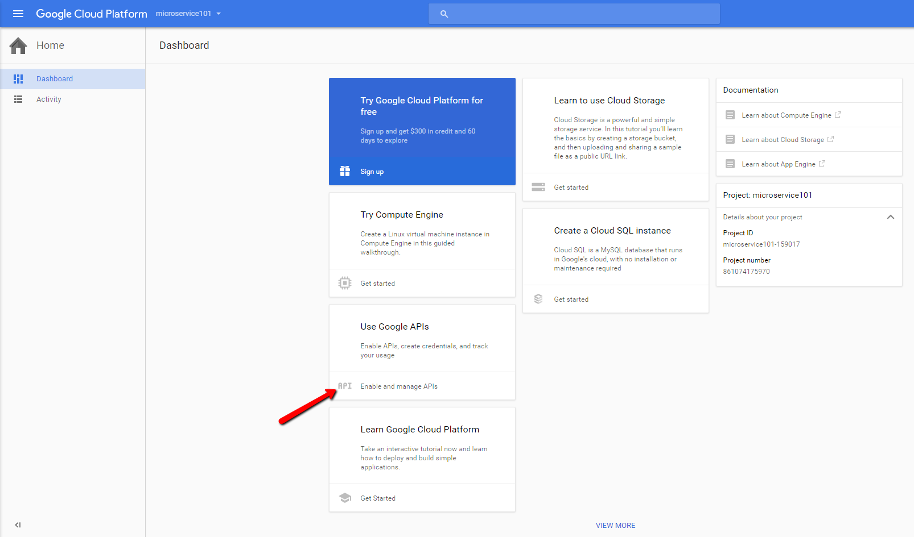

2. Click Enable API

    

3. Choose “Container Engine API”

    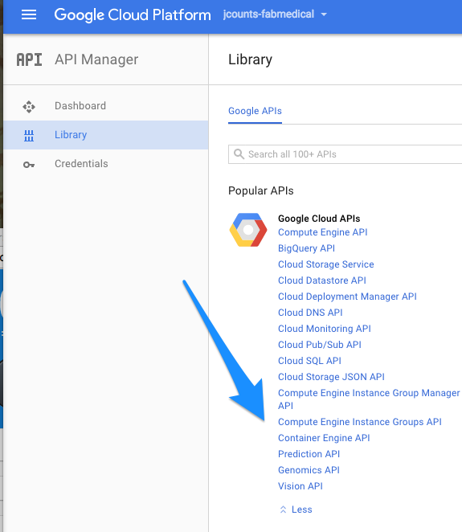

4. Choose “Enable” at the top of the screen

    A warning indicates we must create credentials

    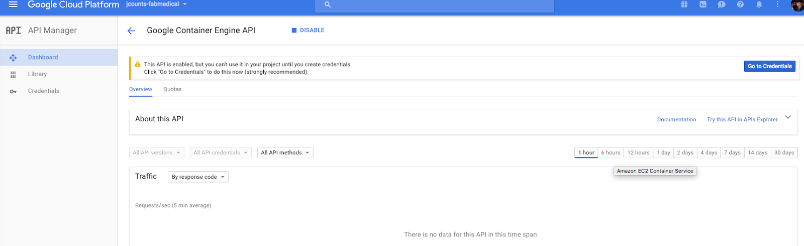

    Ignore this warning. 

5. The container engine API shows a "Disable" button, indicating that it is therefore enabled.

    
    
##Task 5: Install Kubectl
**Duration:** 5 minutes

Kubectl is the command line interface you will use for some of the interactions with kubernetes.  

1. Run this command in bash or git bash from any folder.    

   `$ gcloud components install kubectl`

2. Kubectl will install 
  
    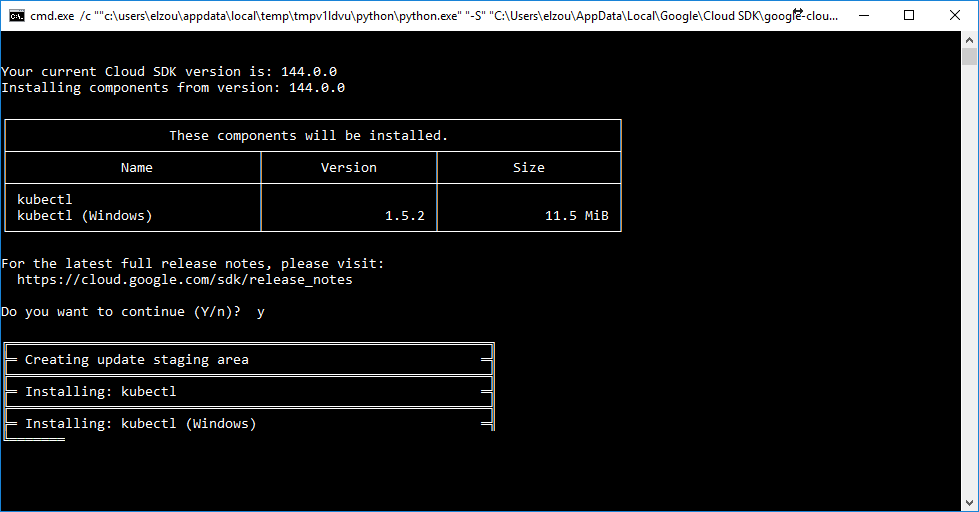

    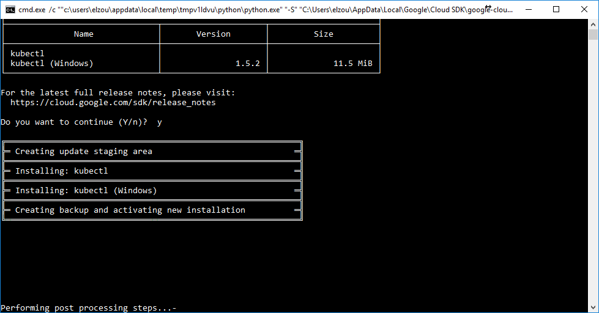

    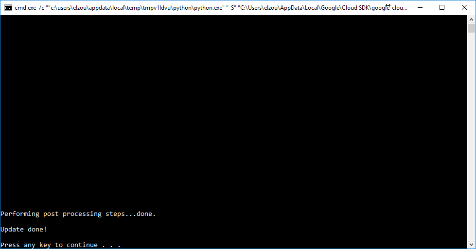
    
    
#Create a Jumpbox 
You will create a jumpbox that you'll use for executing lab instructions to your cluster.

**Duration**: 30 minutes (possibly additional time if Google provisioning is slower)

You should follow all the steps provided in Exercise 0 *before* attending the workshop.

##Task 1: Install Git tools

In this section, you will install Git tools. 
This documentation assumes you are installing Git tools for Windows but you may use another platform to achieve the same results at your own discretion.

1.  Navigate to <https://git-scm.com/download> and select Windows. This will download the latest Git tools executable.

    
    
2. Run the executable, click Next to pass the license dialog, and accept the default Git folder path.

3. On each dialog, choose the settings as shown in the following screen shots, and click Next until reaching the final screen where you will click Install.

    

    

    

    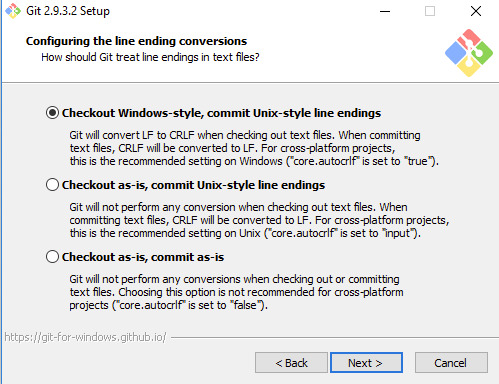

    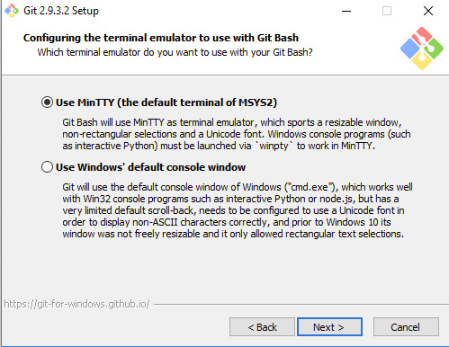

    

    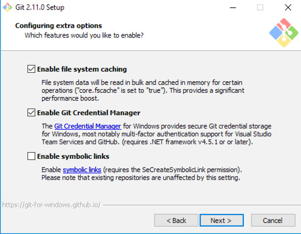

    

4.  When the installation is completed, check Launch Git Bash and click Finish to show the command line window.

    

5. At the end of these steps you should see the Git Bash command line window.

    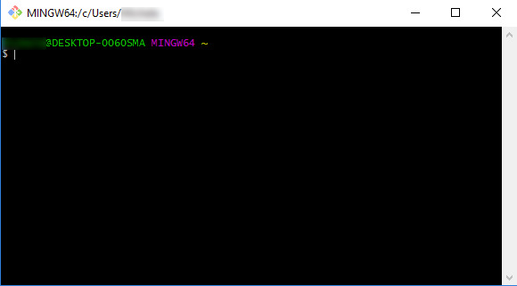
    
##Task 2: Create an SSH key

In this section, you will create an SSH key to securely access the VMs you create during the upcoming exercises.

1.  Open Git Bash to access the command line tool.

    
    
2.  From the command line enter the following command to generate an SSH key pair. You must use “ubuntu” as the comment data.

    `$ ssh-keygen -t RSA -b 2048 -C ubuntu`

    * When prompted enter “fabmedical\_rsa” as the key file name.
    *  Enter a passphrase when prompted, and don’t forget it!

3.  The file will be generated in your user folder where Git Bash opens by default, so be sure to take note of the path.

    
    
4. Navigate to your user folder at c:\\Users\\\[your username\]. You will see the file matching the name you provided.

    

## Task 3: Create a build agent VM

In this section, you will create a Linux VM to act as your build agent.  
You will be installing Docker to this VM once it is set up and you will use this VM during the lab to develop and deploy.

**NOTE: You can set up your local machine with Docker however the setup varies for different versions of Windows. For this lab, the build agent approach simply allows for predictable setup.**

1.  From the console, select the “hamburger” menu in the top left corner.

    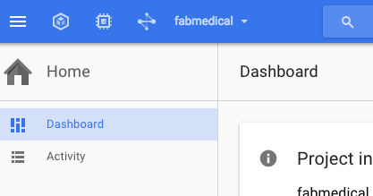

2.  From the list that appears select “Compute Engine”. 

    You may see a message that the compute engine is “getting ready”. 
    Wait for it to finish then click “Create instance”

    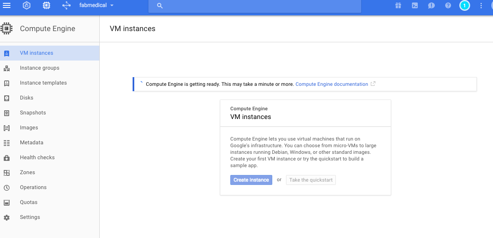

    Enter a unique name such as “fabmedical-SUFFIX” and choose the zone that you did before.

    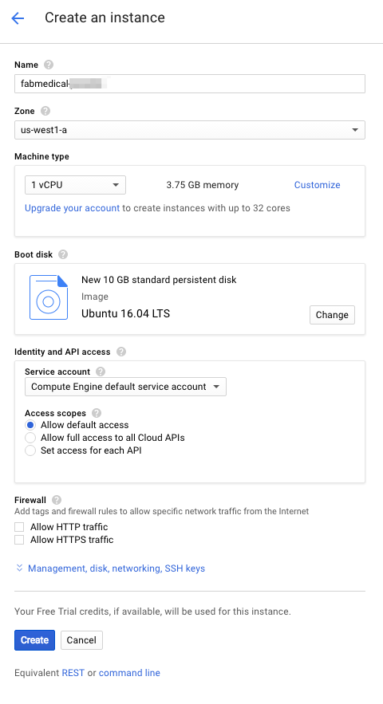
    
    Azure Portal, select Under boot disk, click “Change”

    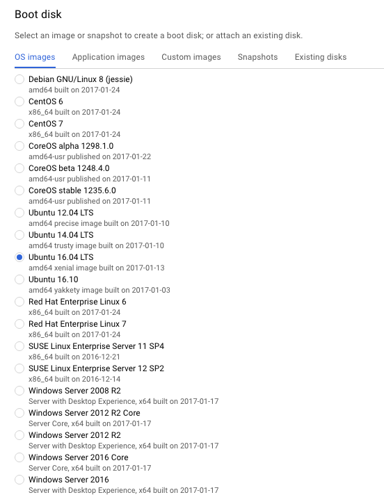

    Choose Ubuntu 16.04 LTS.

    Expand “Management, disk, networking and SSH keys” From your local machine, copy the 
    public key portion of the SSH key pair you created previously, to the clipboard.

3.  From Git Bash, verify you are in your user directory 

    `c:\\Users\\\[your username\]`

4.  Open the public key that you generated, in notepad.

    `notepad fabmedical_rsa.pub`
     
    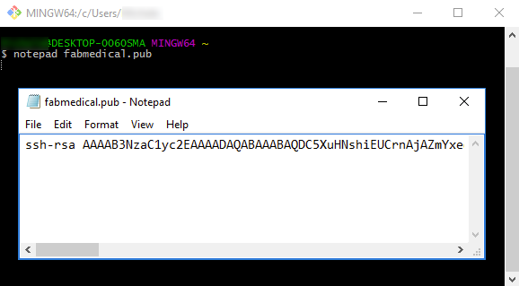

5. Copy the entire contents of the file to the clipboard. 
    Take care not
    to introduce any line breaks or spaces at the beginning or end of
    the text.

6. Paste this value in the SSH public key textbox.

    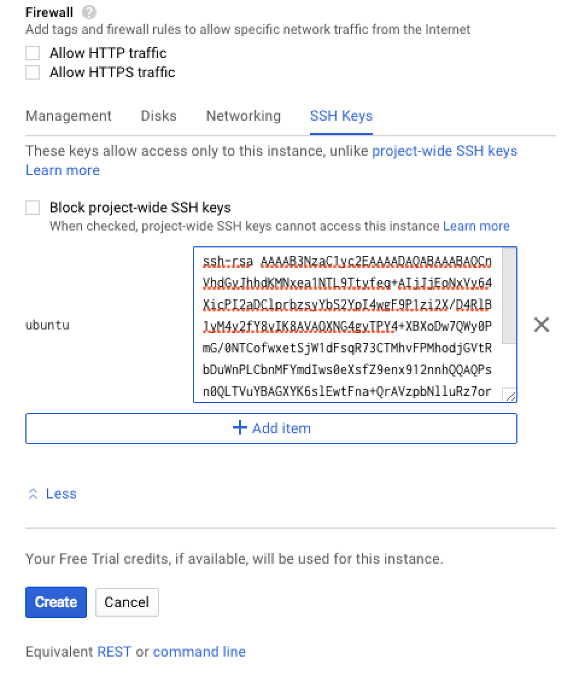

7. Click create to create the instance.

8. The VM will begin deployment to your Google Cloud project.

    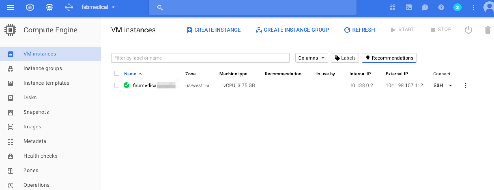

9. When the VM is provisioned you will see it in your list of VM instances belonging to the project you created previously.

## Task 4: Connect securely to the build agent

In this section, you will validate that you can connect to the new build
agent VM.

1.  From the Google Cloud console, navigate to the project you created previously and view the list of VM Instances.

2.  In the entry for fabmedical-SUFFIX, take note of the public IP address for the VM.

    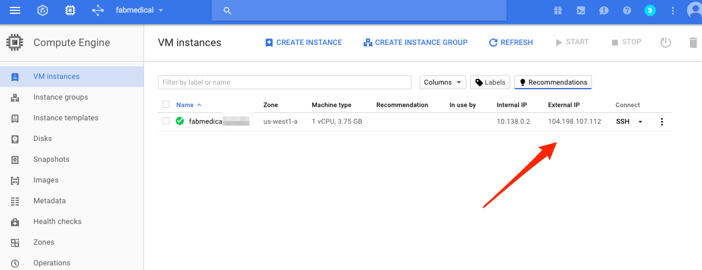

3.  From your local machine, launch Git Bash 
    Navigate to your user
    directory where the key pair was
    previously created.
    
    `c:\\Users\\\[your username\]`

4.  Connect to the new VM you created by typing the following command.

    `ssh -i \[PRIVATEKEYNAME\] \[BUILDAGENTUSERNAME\]@\[BUILDAGENTIP\]`

    Use the private key name such as “fabmedical_rsa”, the username for the VM “ubuntu”, and the IP address for the build agent VM.

    `ssh -i fabmedical_rsa ubuntu@13.68.113.176`

5.  You will be asked to confirm if you want to connect, as the
    authenticity of the connection cannot be validated. Type “yes”.

6.  You will be asked for the pass phrase for the private key you
    created previously. Enter this value.

7. You will now be connected to the VM with a command prompt such as the following. Keep this command prompt open for the next step.

    `ubuntu@fabmedical-soll:\~\$`

    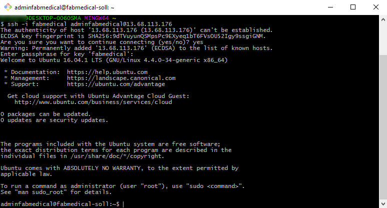

    **NOTE: If you have issues connecting, you may have pasted the SSH
    public key incorrectly. Unfortunately, if this is the case, you must
    recreate the VM and try again.**

## Task 5: Complete the build agent setup

In this task, you will update the packages and install Docker engine.

1.  Go to Git Bash, with the connection open to the build agent VM.

2.  Update the Ubuntu packages and install Docker engine, curl, node.js and the node package manager in a single step by typing the
following in a single line command.

    `sudo apt-get update && sudo apt-get install docker.io curl nodejs npm`

3.  When the command has completed, check the Docker version installed
 by executing this command. The output may look something like that
 shown in the following screen shot. Note that the server version is
not shown yet, because you didn’t run the command with elevated
privileges (to be addressed shortly).

    `docker version`

    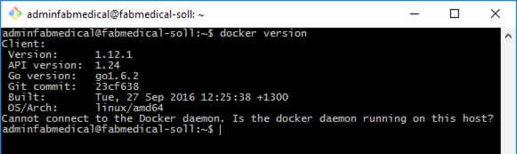

4.  You may check the versions of node.js and npm as well, just for
information purposes, using these commands.

    `nodejs --version`

    `npm -version`

5.  Add your user to the Docker group so that you do not have to elevate
privileges with sudo for every command. You can ignore any errors
you see in the output.

    `sudo usermod -aG docker \$USER`

    NOTE: You may see the following error messages when running the sudo command. They can be ignored.

    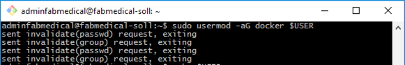

6.  For the user permission changes to take effect, exit the SSH session
by typing ‘exit’, then press &lt;Enter&gt;. Repeat the commands in
Task 5 from step 4 to establish the SSH session again.

7.  Now, run the Docker version command again, and note the output now
    shows the server version as well.

    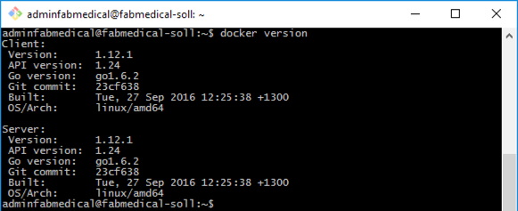

8. Run a few Docker commands.
* One to see if there are any containers presently running
* One to see if any containers exist whether running or not

In both cases, you will have an empty list but no errors running the
command. Your build agent is ready with Docker engine running
properly.

    `docker ps`

    `docker ps -a`

   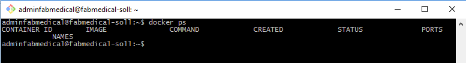

## Task 6: Create a Docker Hub account
Docker images are deployed from a Docker Registry. 
To complete the lab, you will need access to a registry that is publicly accessible to the Google Cloud cluster you are creating. 
In this task, you will create a free Docker Hub account for this purpose, where you push images for deployment.

**NOTE: If you already have a public Docker Hub account you do not need to complete this task – you will need the name of the account for the exercises that rely on it.**

1.  Navigate to Docker Hub at <https://hub.docker.com>.

2.  Create a new Docker Hub account by providing a unique name for your Docker Hub ID, your email address for confirmation of the account, and a password.

    
    
3.  Once you confirm your email address, you can sign in and confirm your Docker Hub account is ready.

    

4. Login to your Docker Hub account. If it is a new account, you will not see any repositories yet. You will create these during the lab.

    

## Task 7: Create a Google Container Engine cluster
In this task, you will create your Google Container Engine cluster based
on kubernetes. You will use the same SSH key you created previously to
connect to this cluster in the next task.

1.  From the Google Cloud Console, select the hamburger menu in the top
left and then select “Container Engine”.

    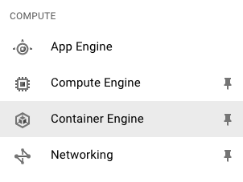

2.  From the Container clusters console click “Create a container
cluster”.

    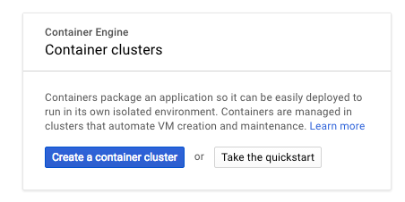

3.  In the “Create a container cluster” configuration screen provide the
information shown in the screen shot that follows:

    * Enter a cluster name such as “fabmedical-SUFFIX”.
    * Choose the same Zone which you selected for your build agent.
    * Customize the machine type and set the amount of memory to 3.5
        GB.
    * Leave the node count at 3.

        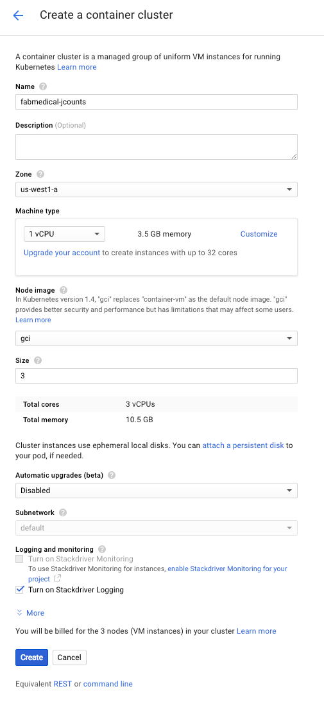

4.  Click “Create”.

5. You should see a successful deployment notification when the cluster
is ready. It can take up to 10 minutes or more before your Google
Container Engine cluster is listed in the Google Cloud Console.

    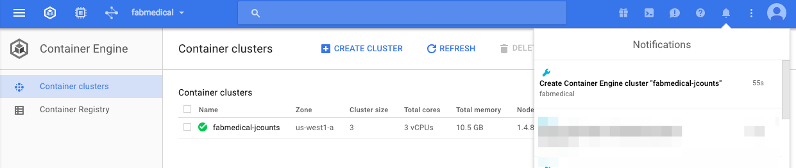

    **Note: If you experience errors related to lack of available vCPUs or disk space, you may have to delete some other 
    compute resources or request additional cores be added to your project and then try this again.**
